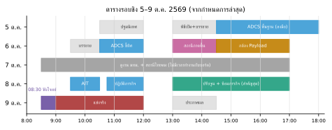

# คู่มือหน้างาน NasaSat — ทีมนาซ่าหน้าปากซอย

รอบชิงชนะเลิศ 5–9 ต.ค. 2569 · โรงแรม ibis Styles Bangkok Ratchada ห้อง APEX ชั้น 3 · แข่งจริง 9 ต.ค. 09:00–12:00 (ฟังโจทย์ 08:30)
พิมพ์หน้านี้ + `CHEATSHEET_TH` ติดตัว · ทฤษฎีอยู่ใน `THEORY_TH` · รายละเอียดคำสั่งอยู่ใน `firmware/PROTOCOL.md`

**กติกาทอง 5 ข้อ**
1. ปุ่ม STOP (Space / Esc) อยู่ใต้มือคนคุมคีย์บอร์ดตลอด
2. ทำอะไรเสร็จ **SAVE** ทันที และ Export โปรไฟล์เก็บ 2 ที่
3. เปลี่ยนทีละอย่าง แล้วทดสอบ ถ้าแย่ลงให้ LOAD กลับ
4. จดผลทุกครั้งรวมครั้งที่พลาด (แท็บ "หลักฐาน & AI" → ดาวน์โหลด log)
5. ตัวเลขที่บอร์ดบอกเป็นค่าประมาณ ความแม่นจริงต้องดูกับของอ้างอิงหรือภาพ

---

## 1. ภาพรวมสัปดาห์

| วัน | กิจกรรมของผู้จัด (กำหนดการล่าสุด) | สิ่งที่ทีมต้องได้กลับมา |
|---|---|---|
| 5 ต.ค. | 10:30 ลงทะเบียน · 11:00 ปฐมนิเทศ · 13:00 พิธีเปิด · 14:30–18:00 ฝึกปฏิบัติพื้นฐานระบบควบคุมทิศทางดาวเทียม | ข้อมูลฮาร์ดแวร์ (ข้อ 2) + คำตอบคำถามกติกา (ข้อ 3) |
| 6 ต.ค. | 10:30 ฝึก ADCS ชี้ทิศ · 13:00 **สื่อสารและควบคุมผ่านสถานีภาคพื้น** · 14:30 **เชื่อมต่อและสั่งงานกล้อง Payload** | รู้ว่าสถานีภาคพื้นคืออะไร ต่อแบบไหน และกล้องใช้บอร์ด/โค้ดอะไร |
| 7 ต.ค. | ดูงาน มทม. + สถานีภาคพื้นไทยคม (ไม่มีเวลาทำงานกับบอร์ด) | ตอนเย็นที่โรงแรม: ปรับค่า/โค้ดตามข้อมูลที่ได้ (ข้อ 4) |
| 8 ต.ค. | 09:30 AIT · 10:45 ปฏิบัติภารกิจ · **13:00–17:00 ปรับปรุงประสิทธิภาพ + ซ้อมภารกิจ** | คาลิเบรตในห้องแข่งจริง + ซ้อมครบ 2 ภารกิจ (ข้อ 5) |
| 9 ต.ค. | 08:30 ชี้แจงภารกิจ · **09:00–12:00 แข่ง** · 13:00 ประกาศผล | ทำตามข้อ 6 |

ก่อนเดินทาง (ภายใน 4 ต.ค.): ทำ `firmware/INSTALL_CHECKLIST.md` ให้ครบบนเครื่องแข่ง, Verify ผ่านทั้ง NasaSat และ Fallback, ซ้อมกับตัวจำลองในเว็บจนคล่อง, สำรองทั้งโฟลเดอร์ลง USB drive, พิมพ์เอกสารนี้

---

## 2. เก็บข้อมูลฮาร์ดแวร์ (5–6 ต.ค.) — กรอกให้ครบ

| เรื่อง | ค่า | วิธีหา |
|---|---|---|
| รุ่นบอร์ด / ตัวอักษรบนโมดูล (เช่น N16R8) | | ดูฝาเหล็กโมดูล, HWID |
| USB เข้าชิปแปลง (CH340/CP210x) หรือ USB ในตัว | | tool แท็บเชื่อมต่อบอก VID |
| ขา LDR ซ้าย / ขวา | | PINFIND + เอามือบัง |
| LDR ต่อฝั่ง 3.3 V หรือ GND | | บังมือแล้ว mV ลด = ฝั่ง 3.3 V |
| ค่าตัวต้านทานคู่ LDR / รุ่น LDR | | ดูบนบอร์ด / ถามผู้จัด |
| มุมเอียง LDR / แบบกล่องกันแสง | | วัด / ถามผู้จัด |
| ตัวขับ: stepper ULN2003 / servo / อื่น ๆ | | ดูของจริง |
| ขา IN1–IN4 ของ ULN2003 (หรือขา servo) | | สกรีนบอร์ด / โค้ดตัวอย่างผู้จัด |
| หมุนได้กี่องศา (สายพันไหม) | | ลองหมุนมือ |
| กล้อง: รุ่น, อยู่บอร์ดเดียวกันไหม, ขา | | ดูของจริง / โค้ดผู้จัด |
| ไฟเลี้ยง: USB อย่างเดียว / มีแบต / มีไฟแยกให้มอเตอร์ | | ดูของจริง |
| ESP32 core ที่ผู้จัดใช้ | | ถามผู้จัด |
| สถานีภาคพื้นคืออะไร (สาย/ไร้สาย, ESP-NOW/Wi-Fi/อื่น) | | อบรม 6 ต.ค. บ่าย |

ถ้าผู้จัดแจกโค้ดตัวอย่าง: ขออนุญาตถ่ายรูปหรือคัดลอก เพราะในนั้นมีเลขขาทั้งหมด

---

## 3. คำถามที่ต้องถามผู้จัด (ถามให้ได้คำตอบภายใน 6 ต.ค.)
1. ใช้ firmware และเครื่องมือของทีมเองได้ไหม หรือต้องใช้โค้ด/โปรแกรมของผู้จัด
2. ภารกิจ 1 วัดผลอย่างไร: มุมแสงกี่มุม, เกณฑ์คลาดได้กี่องศา, วัดจากด้านไหนของดาวเทียม (หน้ากล้อง? เครื่องหมาย?), จำกัดเวลาไหม, ต้องค้างเป้านานเท่าไร
3. ภารกิจ 2 วัดผลอย่างไร: เป้าอยู่ตรงไหน (บอกเป็นมุม? เทียบหลอด?), ภาพต้องชัดแค่ไหน, ส่งภาพให้กรรมการทางไหน (ไฟล์? หน้าจอ?)
4. ต้องสั่งงานผ่าน "สถานีภาคพื้น" ของผู้จัดไหม ถ้าต้อง เชื่อมต่อแบบไหน ใช้คำสั่งอะไร
5. ได้คาลิเบรตในห้องแข่งก่อนเริ่มไหม, หลอดจะย้ายหรือเปลี่ยนความสว่างระหว่างแข่งไหม, ไฟห้องเปิดหรือปิด
6. แข่งพร้อมกันทุกทีม หรือเรียกทีละทีม ได้ลองกี่ครั้ง นับครั้งที่ดีที่สุดไหม
7. มีอินเทอร์เน็ตให้ใช้ไหม ต้องปิดเน็ตระหว่างแข่งไหม
8. สัดส่วนคะแนน (ภารกิจ 1, ภารกิจ 2, นำเสนอ, อื่น ๆ)

---

## 4. คืนวันที่ 7 ต.ค. (ที่โรงแรม)
1. กรอกค่าจากข้อ 2 ลงโปรไฟล์ (แท็บจูนค่า → Export) พร้อมใช้พรุ่งนี้
2. ถ้าฮาร์ดแวร์ต่างจากที่เตรียม (ตัวขับแบบอื่น, กล้องแยกบอร์ด, ต้องไร้สาย) ใช้ลูป AI (ข้อ 9) ปรับโค้ด แล้ว**ทดสอบบนคอมก่อนเสมอ** (`firmware/host_test`) ก่อนเอาไปลงบอร์ดพรุ่งนี้
   มีเตรียมไว้แล้ว ไม่ต้องเขียนใหม่: กล้อง ESP32-CAM แยกบอร์ด (`cam.model 4`, firmware README หัวข้อ "กล้องอยู่อีกบอร์ด"),
   ถอดสาย/ใช้แบต (`m1.auto`, ปุ่ม BOOT), วิทยุ serial เป็นช่องที่สอง (`com.tx/com.rx/com.baud`) ถ้าสถานีภาคพื้นเป็น Wi-Fi/ESP-NOW ใช้บอร์ดสะพานต่อช่องที่สอง หรือให้ AI เพิ่มใน `ops.cpp`
3. ถ้าต้องแก้ firmware: Verify ใน Arduino IDE ให้ผ่าน, เก็บเวอร์ชันก่อนแก้ไว้ด้วย
4. แบ่งหน้าที่พรุ่งนี้ (ข้อ 10) และนอนให้พอ

---

## 5. บ่ายวันที่ 8 ต.ค. 13:00–17:00 (ช่วงสำคัญที่สุด)

| เวลา | ทำอะไร | ได้อะไร |
|---|---|---|
| 13:00–13:30 | เสียบบอร์ด, Upload NasaSat (หรือใช้โค้ดผู้จัดถ้าบังคับ), เชื่อม NasaSatLab, HWID, PINFIND, ตั้งขา, `MOVE 10` ดูว่าหมุนและทิศถูก, SAVE | บอร์ดคุยกับเครื่องมือได้ |
| 13:30–14:00 | หันเข้าหลอด → ZERO → BACKLASH → ตั้ง act.bl; ถ้าหมุนได้ 360° ทำ SPR → ตั้ง act.spr | ตัวขับแม่น |
| 14:00–14:45 | คาลิเบรตครบทุกขั้นใต้ไฟห้องแข่งจริง รวม γ สองระดับแสง (ข้อ 7.3) → Export ผลคาลิเบรต + โปรไฟล์ → ทดสอบบังหลอดด้วยกระดาษแล้วล็อกใหม่ มุมต้องไม่ขยับเกิน 0.3° | มุมที่อ่านได้ตรงของจริง และไม่เพี้ยนตามความสว่างหลอด |
| 14:40–15:25 | ภารกิจ 1 ซ้อม 5 รอบ เริ่มคนละมุม (ซ้าย/ขวา/ไกล) จดเวลาและมุมจริงทุกรอบ | รู้ความแม่นและเวลาจริง |
| 15:25–16:10 | ภารกิจ 2: M2 INIT → "เตรียมกล้อง" (พลิกภาพ → ตรวจทิศภาพ → ล็อกหลอดแล้ววัด boresight) → GO SUN หลายมุม → สแกนรอบตัว + คลิกเป้า 1 ครั้ง | ภาพเป้าหมายใช้ได้ คลิกเล็งได้ |
| 16:10–16:40 | ซ้อมกู้คืน: REBOOT (เว็บต้องต่อใหม่เอง), ถอดเสียบสาย, Import โปรไฟล์ (และ Fallback ถ้ามีเวลา) · ถ้าโจทย์ให้ถอดสาย: ซ้อม `m1.auto` + ปุ่ม BOOT กับแบต | กู้ระบบได้ใน 2 นาที |
| 16:40–17:00 | ดาวน์โหลดหลักฐานทั้งหมด, จดปัญหาที่ต้องแก้คืนนี้ | — |

คืนวันที่ 8: แก้เฉพาะปัญหาที่เจอจริง ทดสอบบนคอม แล้ว **หยุดแก้โค้ดก่อน 22:00** (ของที่ใช้ได้ดีกว่าของใหม่ที่ยังไม่ได้ลอง)

---

## 6. วันแข่ง 9 ต.ค.

| เวลา | ทำอะไร |
|---|---|
| 08:00–08:30 | ลงทะเบียน · ตั้งเครื่อง เปิด NasaSatLab · เสียบบอร์ด (ถ้าอนุญาต) ดูว่า telemetry วิ่ง, RAW ได้ valid ไม่ตัน |
| 08:30–09:00 | ฟังโจทย์: คนที่ 3 จดทุกเงื่อนไขลงตาราง "โจทย์ → ค่าตั้ง" (ด้านล่าง) ถามกรรมการทันทีถ้าไม่ชัด |
| 09:00–09:15 | Import โปรไฟล์เมื่อวาน · ตั้งค่าตามโจทย์ · ถ้าไฟห้องต่างจากเมื่อวาน: ตรวจศูนย์ด้วยท่อเล็ง ถ้าคลาดเกินเกณฑ์ CAL TH0 ใหม่ (30 วินาที) ถ้าไฟเปลี่ยนมากและมีเวลา: AMB + Sweep + Fit + ส่ง + CAL TH0 ใหม่ทั้งชุด (γ สองระดับใช้ค่าเดิม) |
| 09:15–09:25 | ตรวจก่อนลงแข่ง (checklist ข้อ 7.1) + ภารกิจ 1 ลอง 1 รอบ |
| ต่อจากนั้น | ภารกิจ 1 → ภารกิจ 2 ตามที่กรรมการเรียก ทุกรอบจดผล · ผิดปกติกด STOP แล้วใช้ผังแก้ปัญหา (ข้อ 8) |
| 30 นาทีสุดท้าย | ลองซ้ำเฉพาะส่วนที่คะแนนยังขาด · ดาวน์โหลดหลักฐาน · เตรียมตอบคำถาม (THEORY ข้อ 11) |

**ตาราง "โจทย์ → ค่าตั้ง"**

| ในโจทย์ | ค่าตั้ง / คำสั่ง |
|---|---|
| หันเข้าหาแสงตรง ๆ | `M1 START 0` |
| ทำมุม X กับแสง | `M1 START X` (ได้ −80..80) |
| เกณฑ์คลาดไม่เกิน T องศา | ช่อง "เกณฑ์ผ่าน" ในแท็บภารกิจ 1 = T; ถ้า T ≤ 0.5 ลด `ctl.db` เหลือ T/2 |
| ต้องค้างเป้า S วินาที | ช่อง "ต้องคงเป้าต่อเนื่อง" = S |
| ถ่ายเป้าที่อยู่ห่างหลอด X องศา | `M2 GO SUN X` (X บวก = ทิศเดียวกับที่ `MOVE 10` หมุนไป ลองดูทิศก่อน) |
| ถ่ายเป้าที่มุม A ของฐานหมุน | `ZERO` ตรงเครื่องหมาย 0 ของฐาน แล้ว `M2 GO A` |
| ถ่ายเป้า (ไม่บอกมุม) ให้อยู่กลางภาพ | แท็บภารกิจ 2 "สแกนรอบตัว" → คลิกภาพที่เห็นเป้า → คลิกที่เป้า → "เทียบดวงอาทิตย์" (ทนชน) หรือ "หันไปถ่ายตรงนี้" |
| ห้ามหมุนเกินช่วง | `act.min` / `act.max` |
| ภาพต้องละเอียดขึ้น/ส่งเร็วขึ้น | `cam.res` (0 เล็ก … 5 ใหญ่), `cam.q` (เลขน้อย = ชัด) |
| ต้องทำงานโดยไม่ต่อคอม | `SET m1.auto 5` + `SAVE m1.auto` (เปิดเครื่องแล้วเริ่มเอง) หรือกดปุ่ม BOOT · ห้ามลืมตั้ง `m1.tgt` ตามโจทย์แล้ว `SAVE m1.tgt` |
| ต้องสั่งผ่านวิทยุ/สถานีภาคพื้น | วิทยุ serial: `SET com.baud <baud>`, `com.rx`, `com.tx`, `SAVE` → เว็บต่อพอร์ตของวิทยุตัวรับ |
| ต้องรายงานแบต/สุขภาพระบบ | `SET hw.vbat <ขา>`, `SET hw.vdiv <อัตราส่วน>` → `J hk` (หัวเว็บแสดงแบตและอุณหภูมิชิป) |

---

## 7. Checklist

### 7.1 ก่อนรันภารกิจทุกครั้ง
- [ ] telemetry วิ่ง ไม่มีธง ADC ตัน (SAT) · แสง: เห็น (valid)
- [ ] `RAW` ตอนหันเข้าหลอด: mV ทั้งสองช่องอยู่ 500–3000
- [ ] ค่าตั้งตามโจทย์ถูก และ **SAVE แล้ว** (แถบบนไม่มีป้าย "ยังไม่ SAVE")
- [ ] ไม่มีงานค้าง (ไม่มีธง "มีงานรัน")
- [ ] สายไม่พัน หมุนได้ตลอดช่วง
- [ ] คนดูเวลา/จดผล พร้อม

### 7.2 ภารกิจ 1
- [ ] ตั้งมุมเป้า + เกณฑ์ + เวลาคงเป้า → START
- [ ] รอ HOLD แล้วรอครบเวลาคงเป้า ตารางต้องขึ้น "ผ่าน"
- [ ] ถ้า SEARCH นาน: ดูว่าหลอดเปิด, อยู่ในช่วง m1.smin..m1.smax
- [ ] ถ้าแกว่งไม่หยุด: ลด `ctl.k` (0.6) หรือเพิ่ม `ctl.db`

### 7.3 คาลิเบรต (ประมาณ 6–12 นาที)
1. หันเข้าหลอดคร่าว ๆ → `ZERO`
2. `BACKLASH` → ตั้ง act.bl (และ SPR ถ้าหมุน 360° ได้)
3. ปิดหลอด → ขั้น 2 วัดแสงรอบข้าง (รอเอง 1–4 วินาที)
4. เปิดหลอด → ขั้น 4 Sweep −60..60 ทีละ 5
5. ขั้น 5 γ สองระดับแสง (ครั้งเดียวต่อชุด LDR): หันเข้าหลอด → วัดระดับ 1 → กระดาษขาวบังหน้า**หลอด** (ห้ามแตะดาวเทียม แสงต้องลด ≥ 2 เท่า) → วัดระดับ 2 → เอากระดาษออก
6. ขั้น 5 Fit: MAE (+LUT) < 0.3°, γ อยู่ 0.4–0.9, ไม่มีจุดตัน, "γ ขวา/ซ้าย จากแสงสองระดับ ... ใช้แล้ว"
7. ขั้น 6 ตรวจ (กวาดย้อนทิศ bias < 0.2°) → ขั้น 7 ส่ง + SAVE
8. ขั้น 8: หันหน้าดาวเทียมตรงหลอดด้วยของอ้างอิง → ตั้งศูนย์ (บอร์ดบันทึกค่าศูนย์ให้เอง กด SAVE ด้วยก็ได้)
9. Export ผลคาลิเบรต + โปรไฟล์

### 7.4 ภารกิจ 2
- [ ] `M2 INIT` ได้ "ok sensor" (ไม่ได้: ลอง cam.model อื่น, ESP32-CAM = 4)
- [ ] เลือกโฟลเดอร์บันทึกภาพอัตโนมัติ (ภาพทุกภาพ + metadata ลงดิสก์เอง)
- [ ] ภาพกลับหัว/กลับด้าน → ปุ่มพลิก (บันทึกลงบอร์ดให้)
- [ ] "ตรวจทิศภาพ + มุมรับภาพ" (หันให้มีของหลายอย่างหรือหลอดในภาพ) ได้ "เสร็จ" ไม่ใช่ "ไม่แน่ใจ"
- [ ] หลังคาลิเบรต + ตั้งศูนย์แล้ว: "ล็อกหลอดแล้ววัด boresight" → "ใช้ค่านี้ + SAVE"
- [ ] (ถ้าต้องการแสงคงที่) M2 LOCK
- [ ] GO SUN offset (แนะนำ) หรือ GO มุม หรือสแกน + คลิกเป้า → ดูภาพ: เป้าอยู่กลางภาพ, ไม่เบลอ, CRC ผ่าน
- [ ] ถ้าได้ snap_fail: อ่านเหตุผล (เกินช่วงหมุน / คลาดเกิน m2.tol) แก้แล้วลองใหม่

---

## 8. ผังแก้ปัญหา (ทำจากบนลงล่าง)

**เชื่อมต่อไม่ได้ / เงียบ**
0. บอร์ดรีเซ็ตแล้วเว็บขึ้น "กำลังต่อใหม่…": รอ 30 วินาที (ติ๊ก "ต่อใหม่เอง" ไว้) ถ้าไม่กลับมาค่อยทำข้อถัดไป
1. ปิด Serial Monitor ของ Arduino IDE → ต่อใหม่
2. ลองสาย USB เส้นอื่น (บางเส้นชาร์จอย่างเดียว) / พอร์ตอื่น
3. กด RESET บนบอร์ด แล้วต่อใหม่
4. ถ้าเคยเงียบหลังอัปโหลด: USB CDC On Boot ตั้งไม่ตรงชนิด USB → แก้แล้วอัปโหลดใหม่ (INSTALL_CHECKLIST ข้อ 3)

**บอร์ดรีเซ็ตเอง (ดู `E BOOT ...` ในคอนโซล)**
- BROWNOUT → ไฟไม่พอ: ปล่อยขดลวด (act.hold 0), ใช้ hub มีไฟ, แยกไฟมอเตอร์
- TASK_WDT → loop ค้าง: บันทึก log แล้ววิเคราะห์ (ข้อ 9), ใช้งานต่อได้เพราะค่าอยู่ใน flash
- PANIC → โค้ดพัง: บันทึก log, ถ้าซ้ำใช้ Fallback
- รีเซ็ตวนตั้งแต่เปิด → PSRAM ตั้งผิด: เปลี่ยน PSRAM เป็น Disabled แล้วอัปโหลดใหม่

**เซนเซอร์ไม่ขยับ / ค่าแปลก**
- mV ไม่เปลี่ยนเมื่อบังมือ → ขาผิด: PINFIND หาใหม่ → sen.pin0/1
- บังมือแล้ว mV เพิ่ม → sen.topo 1
- ขึ้น adc_saturated → ถอยหลอด / ปิดกระดาษบางทั้งคู่ให้เท่ากัน แล้วคาลิเบรตใหม่
- θ กระโดด → ตรวจสายหลวม, sen.win 20 หรือ 40
- ห้องเปิด/ปิดไฟแล้วมุมเพี้ยน → ตรวจศูนย์ด้วยท่อเล็ง → CAL TH0 ใหม่ (**อย่าวัด AMB ใหม่อย่างเดียว และอย่า Fit ใหม่ด้วย Sweep เก่า** ทดลองแล้วแย่ลงได้ถึง 3°) มีเวลาค่อยทำใหม่ทั้งชุด
- หลอดหรี่/สว่างขึ้นหรือระยะหลอดเปลี่ยนแล้วมุมเพี้ยน → ยังไม่ได้วัด γ สองระดับ หรือวัดตอนตัวดาวเทียมขยับ: วัดใหม่แล้ว Fit
- SEARCH นาน/ไปชนขอบ → หลอดอยู่นอก m1.smin..m1.smax หรือหลอดอยู่หลังเกินที่ตัวขับหมุนถึง (บอร์ดไม่หยุดที่มุมที่หมุนไปไม่ถึง)
- ล็อกช้า/ล็อกไม่ได้ ค่าแกว่ง → `RAW 1000` ดู `th_sd` ถ้าสูงกว่าตอนซ้อมมาก: ตรวจสาย/กราวด์/ไฟมอเตอร์ `ctl.adapt 1` ช่วยอยู่แล้ว

**มอเตอร์**
- ไม่หมุน (ไฟ LED บน ULN2003 ไม่กระพริบ) → ขา act.in1..4 ผิด
- LED กระพริบแต่ไม่หมุน → ไฟ 5 V ของมอเตอร์ไม่มา / สายมอเตอร์หลวม
- สั่น/หลุด step → ลด act.vmax (25) หรือ act.acc
- ภารกิจ 1 วิ่งหนีแสง → act.dir −1
- ตำแหน่งไม่ซ้ำ → BACKLASH ใหม่, ตรวจ ctl.appr = 1

**กล้อง / ภาพ**
- init fail → cam.model อื่น, ขากล้องใน board_config.h (cam.model 3), M2 INIT หรือ REBOOT
- ภาพเสีย/ขาด → ลอง SNAP ใหม่ (tool ขอชิ้นที่หายซ้ำเอง), ลด cam.res
- ภาพเบลอ → เพิ่ม m2.settle (600), cam.flush 3
- ภาพมืด/สว่างเกิน → M2 UNLOCK ให้ปรับเอง แล้ว LOCK ใหม่ตอนหันเข้าเป้า
- `not for this chip` → cam.model ผิดชิป (ESP32-S3 ใช้ 1/2/3, ESP32-CAM ใช้ 4)
- คลิกเป้าแล้วถ่ายใหม่ เป้าไปอยู่อีกฝั่งของภาพ → ทิศภาพผิด: "ตรวจทิศภาพ" ใหม่ (เคยพลิกภาพหลังตรวจ? โปรแกรมคิดให้แล้ว ถ้ายังผิดให้ตรวจใหม่)
- "ตรวจทิศภาพ" ขึ้น "ไม่แน่ใจ" → หันไปทางที่มีของ/หลอดในภาพ หรือเปิดไฟ แล้วลองใหม่

**ไม่ต่อคอม / วิทยุ**
- เปิดเครื่องแล้วไม่เริ่มเอง → `m1.auto` ยังไม่ SAVE (`SAVE m1.auto`) หรือมีคนกด STOP ระหว่างรอ
- กดปุ่ม BOOT ไม่มีอะไร → `hw.btn -1` หรือกล้องใช้ขา 0 (ESP32-CAM) ดู `J hk` ฟิลด์ `btn`
- วิทยุเงียบ → `com.baud` ตรงกับวิทยุไหม, TX บอร์ด → RX วิทยุ, เห็น `E LINK ON` ไหม
- ภาพผ่านวิทยุช้า → `cam.res 0` (320×240 ≈ 10 s ที่ 9600 baud) หรือ `com.limg 0` ให้ภาพออก USB อย่างเดียว

**compile ไม่ผ่าน**
- error เกี่ยวกับกล้อง → ตรวจว่าใช้ไฟล์ล่าสุด (compile ผ่าน core 3.3.5 แล้ว) ส่ง error ให้ AI; features.h: ENABLE_CAMERA 0 เป็นทางสุดท้าย (ภารกิจ 2 หาย)
- อย่างอื่น → ส่งข้อความ error บรรทัดแรก ๆ ให้ AI (ข้อ 9), ระหว่างนั้นใช้ Fallback.ino

**ทุกอย่างพังและเหลือเวลาน้อย** → อัปโหลด `firmware/Fallback/Fallback.ino` (แก้ขาบรรทัดบนสุด) → หันตรงหลอดด้วยตา → `BAL` → `M1 START`

---

## 9. ลูป "วัด → AI → แก้ → ทดสอบ" (ภายใน 10 นาที)
1. (1 นาที) ทำให้ปัญหาเกิดซ้ำ แล้วกด STOP
2. (1 นาที) แท็บ "หลักฐาน & AI" → "DIAG + สร้างใหม่" → คัดลอก
3. (2 นาที) วางในแชท AI พร้อม: อาการ, คำสั่งที่ส่ง, สิ่งที่คาดไว้, และแนบ `firmware/CONTEXT_PACK.md` ถ้าเป็นแชทใหม่
4. (3 นาที) ทำตามทีละข้อ **เปลี่ยนทีละอย่าง** ส่วนใหญ่เป็น `SET ...` ไม่ต้องอัปโหลดใหม่
5. (3 นาที) ทดสอบซ้ำ ดีขึ้น → SAVE + Export; แย่ลง → LOAD
ถ้าเกิน 10 นาทีแล้วยังไม่หาย ให้ถอยกลับค่าที่ใช้ได้ล่าสุด แล้วไปทำส่วนอื่นก่อน

ตัวอย่างคำถามที่ดี: "ภารกิจ 1 ล็อกแล้วแต่เมื่อวัดด้วยท่อเล็งคลาด 1.2° ไปทางซ้ายทุกครั้ง ข้อมูล DIAG ด้านล่าง ควรแก้ค่าไหน"

**ไม่มีอินเทอร์เน็ต**: ใช้มือถือแชร์เน็ต (tethering) ถ้ายังไม่ได้ ใช้ผังข้อ 8 + ตารางแก้ปัญหาใน `firmware/README.md` ซึ่งครอบคลุมปัญหาที่พบบ่อยทั้งหมด

---

## 10. แบ่งหน้าที่ 3 คน

| คน | หน้าที่ระหว่างแข่ง | ต้องอธิบายกรรมการได้ |
|---|---|---|
| A คุมคีย์บอร์ด | ส่งคำสั่ง, คุม STOP, ตั้งค่าตามโจทย์ | ขั้นตอนคาลิเบรต, การควบคุม (THEORY 4, 6) |
| B ฮาร์ดแวร์/กล้อง | จัดหลอด/ฐาน/สาย, ของอ้างอิง, ภารกิจ 2 | เซนเซอร์, กล่องกันแสง, กล้อง (THEORY 2, 3, 7) |
| C จดบันทึก/เวลา | จดโจทย์ → ค่าตั้ง, จับเวลา, จดผลทุกครั้ง, ดาวน์โหลดหลักฐาน, เปิดผังแก้ปัญหา | งบความคลาด, FDIR, ผลทดสอบ (THEORY 5, 8, 10) |

พูดกันสั้น ๆ ชัด ๆ: "STOP", "SAVE แล้ว", "HOLD แล้ว", "เริ่มจับเวลา"
