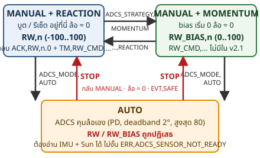
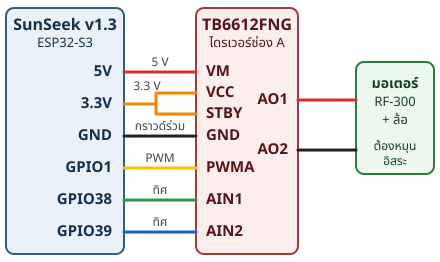

# SunSeek โพยหน้างาน — Workshop T01 + T02 (บอร์ด SunSeek v1.3 · เฟิร์มแวร์ผู้จัด v2.1)

**ทีมนาซ่าหน้าปากซอย** · เฟิร์มแวร์: `C:\TYSC\SunSeek\workshop\SunSeek_Platform_Firmware_v2_1\` = ของผู้จัดไม่แก้อะไร ยกเว้น `#define TEAM_NAME "NasaPakSoi"` ใน `Config_System.h` → ชื่อ BLE `SUNSEEK-NasaPakSoi` · ข้อความตอบกลับทุกบรรทัดในโพยนี้อ่านจากโค้ด `System_CommandRouter.h` / `System_Telemetry.h` / `Module_ReactionWheel.h` **ยังไม่เคยลองกับบอร์ดจริง** ถ้าบอร์ดตอบต่างจากนี้ ให้เชื่อบอร์ดแล้วจดไว้

## 1. กฎเหล็ก + คำศัพท์

1. **มือพร้อม STOP เสมอ** — พิมพ์ `STOP` ก่อนแตะล้อ ก่อนเปลี่ยนสาย ก่อนอัปโหลด และก่อนทดสอบหลุดลิงก์ (BLE หลุด ล้อ **ไม่หยุดเอง**)
2. **ไม่มีอะไรขวางล้อ** — ล้อหมุนอิสระ ยึดแน่นกับแกน ไม่มีสาย มือ ผม เสื้อ ใกล้ล้อ แล้วค่อยจ่ายไฟ
3. **เริ่มเบา** — เริ่มที่ `RW,20` ไม่เกิน 40 จนกว่าจะรู้ว่าล้อไม่สั่น ห้ามกระโดดไป `RW,100`
4. **รอ ACK ทุกคำสั่ง** — `ACK,...` = รับแล้ว · `ERR,...` = ปฏิเสธ (ERR ไม่บอกว่าปฏิเสธคำสั่งไหน) · เงียบ = เช็กสาย / Newline / พอร์ต
5. **พิมพ์ให้เป๊ะ** — ตัวพิมพ์ใหญ่ตรงตัว ไม่เกิน 240 ตัวอักษร ช่องว่างรอบ `,` บอร์ดตัดให้เอง
6. **พอร์ตใช้ได้ทีละโปรแกรม** — ปิด Serial Monitor ก่อนอัปโหลด หรือก่อนเปิด NasaSat Lab
7. **จดทุกค่า ไม่เดา** — PWM % **ไม่ใช่** % ความเร็วล้อ (ไม่ได้วัด RPM) · I_w ไม่ได้วัดให้เขียน `TBD`

| คำ | ความหมาย |
|---|---|
| TC | คำสั่งจากเราไปบอร์ด เช่น `PING` `RW,30` |
| TM | ข้อมูลที่บอร์ดรายงาน `TM,ชื่อ,ค่า,ชื่อ,ค่า,...` |
| ACK / ERR | `ACK,คำสั่ง,...` รับแล้ว · `ERR,รหัส` ปฏิเสธ · `PING` ตอบ `PONG` |
| EVT | เหตุการณ์ที่บอร์ดแจ้งเอง เช่น `EVT,SAFE` (หลัง STOP) |
| PWM | แรงขับมอเตอร์ 0–255 · `RW,n` = PWM n% คือ n×255/100 เช่น `RW,20` = 51 จาก 255 · ไม่ใช่ % ของรอบหมุน |
| BIAS | จุดทำงานของล้อแบบ MOMENTUM (PWM 0–100) ตั้งด้วย `RW_BIAS,n` ล้อหมุนทันที |
| DELTA | ค่าบวกเพิ่มจาก BIAS: TARGET = BIAS + DELTA ต้องได้ 0–100 |
| ASSIST | คำสั่งมอเตอร์ชั่วคราว −100..100 ช่วยให้เปลี่ยนความเร็วเร็วขึ้น |
| DURATION | เวลาที่ ASSIST ทำงาน (ms) หมดแล้วกลับไป TARGET ได้ `EVT,RW_MANEUVER_COMPLETE,<bias>` |
| MANUAL / AUTO | MANUAL = เราสั่งล้อเอง (ค่าตอนบูต) · AUTO = ADCS คุมล้อ สั่ง `RW` ไม่ได้ · `STOP` กลับ MANUAL |
| REACTION / MOMENTUM | REACTION ใช้ `RW,n` −100..100 (ค่าตอนบูต) · MOMENTUM ใช้ `RW_BIAS,n` 0..100 · สลับแล้วล้อหยุด bias=0 |



## 2. ต่อสาย + เช็กก่อนจ่ายไฟ

### 2.1 ต่อสายไดรเวอร์ TB6612FNG (ทำตอนปิดสวิตช์ ถอด USB)
**ของบนโต๊ะ**: SunSeek v1.3 · โมดูล TB6612FNG · มอเตอร์ RF-300 + ล้อ · สายจั๊มพ์ · สาย USB (ต้องเป็นสายข้อมูล)



| SunSeek | TB6612FNG | ทำหน้าที่ |
|---|---|---|
| 5V | VM | ไฟมอเตอร์ |
| 3.3V | VCC | ไฟลอจิก |
| GND | GND | กราวด์ร่วม |
| 3.3V | STBY | เปิดไดรเวอร์ |
| GPIO1 | PWMA | ความแรง (PWM) |
| GPIO38 | AIN1 | ทิศ |
| GPIO39 | AIN2 | ทิศ |
| (มอเตอร์) | AO1 / AO2 | สลับสาย 2 เส้น = กลับทิศหมุน |

> **ระวัง** STBY ไม่ได้ต่อ 3.3 V (ลอย) = ไดรเวอร์ไม่ทำงาน ล้อไม่หมุนทั้งที่บอร์ดตอบ `ACK` · บอร์ดมี **สวิตช์ OFF/ON แยก** เสียบ USB อย่างเดียวพอร์ต COM ไม่ขึ้น (ชิป USB เป็น CP210x)

**ขาอื่นของบอร์ด** (ไม่ใช้ใน T01): LDR ในเฟิร์มแวร์ ซ้าย = io17, ขวา = io16 · IMU GY-89 SDA = io8, SCL = io9 · กล้อง UART: TX io41 → CAM RX0, RX io42 ← CAM TX0

### 2.2 เช็กลิสต์ 9 ข้อก่อนจ่ายไฟ (ติ๊กทีละข้อ ให้ผู้สอนหรือเพื่อนในทีมตรวจก่อน)
- [ ] VM ← 5 V และ VCC ← 3.3 V ถูก rail
- [ ] GND ของ SunSeek กับ TB6612FNG ต่อร่วมกัน
- [ ] PWMA = GPIO1, AIN1 = GPIO38, AIN2 = GPIO39 ถูกขา
- [ ] STBY ← 3.3 V (เปิดไดรเวอร์)
- [ ] มอเตอร์ต่อ AO1 / AO2
- [ ] ล้อหมุนอิสระ (ใช้นิ้วหมุนเบา ๆ ตอนยังไม่มีไฟ)
- [ ] ไม่มีสายหรือโครงสร้างขวางล้อ
- [ ] ล้อยึดกับแกนมอเตอร์แน่น
- [ ] ผู้สอน/คนในทีมตรวจสายแล้ว ชื่อ ______ เวลา ______

### 2.3 ตรวจ LDR ซ้าย/ขวา (ป้าย L/R บนบอร์ดเคยสลับกับของจริง อย่าเชื่อป้าย)
1. ส่ง `TM_STREAM,SUN,ON` → ได้ `ACK,TM_STREAM,SUN,ON` แล้วมี `TM,SUN_L,<n>,SUN_R,<n>,SUN_NDV,<x>,SUN_ANGLE,<x>` ประมาณ 5 บรรทัดต่อวินาที
2. เอานิ้วบังหน้า LDR ทีละตัว ดูว่าเลขตัวไหนเปลี่ยนมาก (`SUN_L` หรือ `SUN_R`) จดว่าตัวทางซ้ายของบอร์ดคือตัวไหน
3. ส่ง `TM_STREAM,QUIET` → `ACK,TM_STREAM,QUIET` (หยุดสตรีม)

## 3. อัปโหลดเฟิร์มแวร์

**ของบนโต๊ะ**: โน้ตบุ๊ก + Arduino IDE · บอร์ดต่อ USB และสวิตช์ ON · โฟลเดอร์ `C:\TYSC\SunSeek\workshop\SunSeek_Platform_Firmware_v2_1\`
1. ปิด Serial Monitor และกด "ตัดการเชื่อมต่อ" ใน NasaSat Lab (พอร์ตใช้ได้ทีละโปรแกรม)
2. เปิด `SunSeek_Platform_Firmware_v2_1.ino` (ไฟล์อื่นในโฟลเดอร์ต้องอยู่ข้างกัน ห้ามแยก)
3. ตรวจ `Config_System.h` ต้องเป็น `#define TEAM_NAME "NasaPakSoi"`
4. Tools → Board → **ESP32S3 Dev Module** · Tools → **USB CDC On Boot → Disabled** · Tools → Port → พอร์ต COM ของบอร์ด
5. กด Upload รอ "Done uploading"
6. เปิด Serial Monitor: **115200 baud** และท้ายหน้าต่างเลือก **Newline** (ถ้าเลือก No line ending คำสั่งจะไม่ทำงาน)
7. กดปุ่ม RESET บนบอร์ดหนึ่งครั้ง ต้องเห็น (รอประมาณ 1 วินาที):

```
SUNSEEK PLATFORM v2.1 — Training Firmware
Spacecraft ID: SUNSEEK-NasaPakSoi
Payload UART: TX=GPIO41 RX=GPIO42 @115200
TM,SENSOR_ACCEL,READY
TM,SENSOR_MAG,READY
TM,SENSOR_GYRO,READY
TM,SENSOR_BARO,DETECTED
TM,SENSOR_SUN,READY
TM,ADCS_MODE,MANUAL,ADCS_REFERENCE,SUN,TARGET,0.00,KP,2.000,KD,0.500,MOMENTUM_BIAS,40,DEADBAND,2.00,MAX_RW_COMMAND,80,CONTROL_SIGN,1.0
```
8. พิมพ์ `PING` Enter → ต้องได้ `PONG`

> **ระวัง** เซนเซอร์ที่ไม่ได้ต่อจะขึ้น `NOT_DETECTED` (ไม่เป็นไรสำหรับ T01 เพราะ T01 ใช้แค่ล้อ) · ไม่มีอะไรขึ้นเลย: เช็กสวิตช์ ON, พอร์ต COM, baud 115200, ถ้าเห็นขยะให้เช็ก baud · เปิด Serial Monitor ค้างไว้แล้วอัปโหลดไม่ผ่าน: ปิดก่อน

**จด**: Spacecraft ID ที่เห็น `SUNSEEK-________` · พอร์ต COM ______

## 4. Workshop T01 — Reaction Wheel (ใช้ USB เท่านั้น ยังไม่ใช้ BLE)

> **ระวัง** PDF T01 พูดถึงเฟิร์มแวร์ 3 ไฟล์ "T01 v1.0" ที่ **ไม่ได้แจก** — เราใช้ v2.1 ตัวเดียวทั้ง T01/T02 และ v2.1 รับคำสั่ง T01 ได้ครบ: `RW,<ค่า>` `STOP` `STATUS` (คำสั่ง `BIAS,<ค่า>` ใน PDF **ไม่มี**ใน v2.1 จะได้ `ERR,UNKNOWN_COMMAND` ใช้ `RW_BIAS` ตอน T02)

ตอนบูต v2.1 อยู่ **MANUAL + REACTION** อยู่แล้ว (โค้ด: `_a.mode = ADCS_MANUAL` ใน `Module_ADCS.h`, `_rwMode = RW_MODE_REACTION` ใน `Module_ReactionWheel.h`) จึงสั่ง `RW,n` ได้เลย ไม่ต้องสั่ง `ADCS_STRATEGY,REACTION` ก่อน

| คำสั่ง | ที่ v2.1 ตอบจริง (บอร์ด → เรา) |
|---|---|
| `RW,20` | `ACK,RW,20.0` ¶ `TM,RW_CMD,20,RW_BIAS,0,RW_STATE,REACTION_DRIVE` |
| `RW,-20` | `ACK,RW,-20.0` ¶ `TM,RW_CMD,-20,RW_BIAS,0,RW_STATE,REACTION_DRIVE` |
| `RW,0` | `ACK,RW,0.0` ¶ `TM,RW_CMD,0,RW_BIAS,0,RW_STATE,STOPPED` |
| `RW,150` หรือ `RW,abc` | `ERR,RW_INVALID_OR_RANGE` (ล้อไม่เปลี่ยน) |
| `STOP` | `ACK,STOP` ¶ `EVT,SAFE` (ล้อหยุด, ไม่มีบรรทัด TM ตามมา) |
| `STATUS` | `ACK,STATUS` แล้ว TM 12 บรรทัด ที่ต้องดู 2 บรรทัด: `TM,SAT_ID,SUNSEEK-NasaPakSoi,BLE,DISCONNECTED,ADCS_MODE,MANUAL,ADCS_STRATEGY,REACTION` และ `TM,RW_CMD,0,RW_BIAS,0,RW_STATE,STOPPED` |

### 4.0 เริ่ม T01 ทุกครั้ง (30 วินาที)
1. ผ่านเช็กลิสต์ 9 ข้อ (ข้อ 2.2) และ Serial Monitor เป็น 115200 + Newline
2. ส่ง `STOP` → ต้องได้ `ACK,STOP` และ `EVT,SAFE`
3. ส่ง `STATUS` → บรรทัด `TM,SAT_ID,...` ต้องมี `ADCS_MODE,MANUAL,ADCS_STRATEGY,REACTION` และ `TM,RW_CMD,0,RW_BIAS,0,RW_STATE,STOPPED` ถ้าไม่ใช่ ส่ง `ADCS_MODE,MANUAL` แล้ว `ADCS_STRATEGY,REACTION` (ได้ `ACK,...` ทั้งคู่)

### 4.1 การทดลองที่ 1 — ทดสอบหมุน + ทิศทาง
**ของบนโต๊ะ**: บอร์ดต่อสายผ่านเช็กลิสต์ · Serial Monitor · ปากกา · นาฬิกา/มือถือจับเวลา
1. ส่งทีละคำสั่งตามลำดับนี้ **รอล้อนิ่ง/หมุนคงที่ ประมาณ 3 วินาที** ก่อนส่งคำสั่งถัดไป และจดผลในตาราง: `RW,20` → `RW,40` → `RW,60` → `RW,40` → `RW,20` → `STOP` → `RW,-20` → `RW,-40` → `STOP`
2. ทุกคำสั่ง `RW,n` ต้องได้ `ACK,RW,n.0` + `TM,RW_CMD,n,RW_BIAS,0,RW_STATE,REACTION_DRIVE` · `STOP` ต้องได้ `ACK,STOP` + `EVT,SAFE` และล้อต้องหยุด
3. ดูว่าล้อเริ่มหมุนหรือไม่ ทิศไหน (มองจากด้านบนล้อ ทวนหรือตามเข็มนาฬิกา) เสียง/สั่น
4. ถ้าติดบนแท่นที่หมุนได้: ตัวแท่นหมุนทิศตรงข้ามกับล้อหรือไม่

> **ระวัง** ล้อเร็วขึ้นไม่เท่ากับเลขเพิ่ม (PWM ≠ RPM) · เห็น `ACK` แต่ล้อไม่หมุน = สาย STBY/VM/AO1-AO2 ไม่ใช่โค้ด · ถ้าสั่นผิดปกติ หรือมีเสียงครูด ส่ง `STOP` ทันที

| # | คำสั่ง | เริ่ม/หยุดตามสั่ง? | ทิศ | สังเกต |
|---|---|---|---|---|
| 1 | `RW,20` | | | |
| 2 | `RW,40` | | | |
| 3 | `RW,60` | | | |
| 4 | `RW,40` | | | |
| 5 | `RW,20` | | | |
| 6 | `STOP` | | | |
| 7 | `RW,-20` | | | |
| 8 | `RW,-40` | | | |
| 9 | `STOP` | | | |

**จด**: ทิศของทีม — คำสั่ง **+** = ล้อหมุน ________ · คำสั่ง **−** = ล้อหมุน ________ (โค้ด: + = AIN1 สูง/AIN2 ต่ำ, − = กลับกัน) · แท่น: ________

### 4.2 การทดลองที่ 2 — PWM ต่ำสุดที่ใช้ได้ (Minimum Start / Minimum Stable)
**ของบนโต๊ะ**: เหมือน 4.1 · ตารางด้านล่าง
**ส่วน A — Start from rest (ค่าบวก)** ทำทีละค่า 5, 10, 15, 20, 25, 30:
1. `STOP` แล้วรอล้อหยุดสนิท · 2. ส่ง `RW,5` (ค่าถัดไป `RW,10` `RW,15` `RW,20` `RW,25` `RW,30`) · 3. ดู 3 วินาที: ล้อเริ่มหมุนเองไหม · 4. จดว่า เริ่ม/ไม่เริ่ม, หมุนนิ่งไหม, สั่น/เสียง
- **Minimum Start PWM** = ค่าน้อยสุดที่ล้อเริ่มหมุนได้ **สม่ำเสมอ** (ลอง 2 รอบให้ผลเหมือนกัน)

**ส่วน B — Stable (ลดลง)**: 1. `RW,30` รอจนหมุนนิ่ง · 2. ลดเป็น `RW,25` → `RW,20` → `RW,15` → `RW,10` → `RW,5` ทีละขั้น รอ 3 วินาทีทุกขั้น · 3. **Minimum Stable PWM** = ค่าน้อยสุดที่ล้อยังหมุนต่อเนื่อง ไม่ค้าง/สะดุด · 4. `STOP`

**ส่วน C — ทำซ้ำค่าลบ** `RW,-5` `RW,-10` `RW,-15` `RW,-20` `RW,-25` `RW,-30` แบบเดียวกับ A และ B

> **ระวัง** ต้อง `STOP` แล้วรอจนล้อหยุดก่อนทุกค่าใน A ไม่งั้นคือ "ลดความเร็ว" ไม่ใช่ "เริ่มจากหยุด" · ค่า Start มักสูงกว่า Stable (แรงเสียดทานสถิต) ถ้าเท่ากันก็จดว่าเท่ากัน

| PWM % | เริ่มจากหยุด? | นิ่ง? | สั่น/เสียง | หมายเหตุ |
|---|---|---|---|---|
| 5 | | | | |
| 10 | | | | |
| 15 | | | | |
| 20 | | | | |
| 25 | | | | |
| 30 | | | | |
| −5 | | | | |
| −10 | | | | |
| −15 | | | | |
| −20 | | | | |
| −25 | | | | |
| −30 | | | | |

**จด**: Minimum Start PWM + ______ % / − ______ % · Minimum Stable PWM + ______ % / − ______ % · สองค่านี้เหมือนกันไหม ☐ ใช่ ☐ ไม่ (เพราะ ________)

### 4.3 การทดลองที่ 3 — กลับทิศ (Direction Reversal)
**ของบนโต๊ะ**: เหมือน 4.1 · มือถือถ่ายวิดีโอใกล้ ๆ (ถ้ามี)
- [ ] เริ่มจากค่าต่ำ · [ ] ล้อ/โครงยึดแน่น · [ ] พร้อมพิมพ์ `STOP` ถ้าสั่นหรือชน
1. `STOP` แล้ว `RW,30` → `ACK,RW,30.0` รอจนล้อหมุนนิ่งสม่ำเสมอ (ประมาณ 5 วินาที)
2. ส่ง `RW,-30` → `ACK,RW,-30.0` ทันที (บอร์ดสลับทิศและ PWM ทันที ไม่มีการค่อย ๆ เปลี่ยน) ดูและฟังล้อตั้งแต่วินาทีที่ส่ง
3. รอจนหมุนนิ่งทิศใหม่ แล้ว `STOP`

> **ระวัง** อย่าลองที่ค่าสูง ถ้ามีสั่นหรือชนให้ `STOP` ก่อนค่อยคิด

**จด**: ก่อนเปลี่ยนทิศ ________ · ระหว่างกลับทิศ ________ · หลังกลับทิศ ________ · เสียง/สั่น ________ · คำสั่งเปลี่ยนเครื่องหมายทันที แต่ล้อกลับทิศทันทีไหม? เพราะอะไร (ร่างคำตอบอยู่ข้อ 8)

### 4.4 การทดลองที่ 4 — ช่วงใช้งาน + บันทึก + ใส่ค่า
1. จากผล 4.1–4.3 เลือกช่วง "ใช้งานได้ดี" ไม่ต้องกว้างสุด: min ______ % · max ______ % · ช่วงที่ควรเลี่ยง (สั่น) ______ · ค่าทดสอบที่ชอบ ______ %
2. ลองยืนยัน: `STOP` → `RW,<min>` ต้องเริ่มหมุนเอง → `RW,<max>` → `STOP`
3. กรอกตาราง Carry Forward ส่งต่อ T02 และ **เขียนลงกระดาษ Engineering Record** (ของจริง) ก่อนเสมอ

| ค่าส่งต่อ T02 | ค่าของทีม |
|---|---|
| RW_MIN_START | ______ % |
| RW_MIN_STABLE | ______ % |
| RW_OPERATING_RANGE | ______ ถึง ______ % |
| RW_POSITIVE_DIRECTION | |
| RW_VIBRATION_RANGE | |
| I_w | ______ / TBD (ห้ามเดา) |

**ใส่ค่าในโค้ดที่ไหน (ถ้าผู้สอนให้ใส่)**: ไฟล์ `Config_Actuator.h` ใน `C:\TYSC\SunSeek\workshop\SunSeek_Platform_Firmware_v2_1\` แก้แล้วต้อง Upload ใหม่
- `#define RW_MIN_START_PERCENT 5` ← Minimum Start ที่วัดได้ (โค้ด v2.1 ไม่มีส่วนไหนอ่านค่านี้ ใช้เป็นบันทึกของทีม)
- `#define RW_DEFAULT_BIAS_PERCENT 40` ← bias ที่ทีมเลือก **ค่านี้มีผลจริง**: เป็นค่า bias เริ่มต้นของ ADCS (โผล่เป็น `MOMENTUM_BIAS` ในบรรทัด TM) ห้ามใส่ถ้ายังไม่ได้วัด
- `#define RW_DEFAULT_ASSIST_PERCENT 80` ← assist ที่ทีมเลือก (จดไว้ ไม่มีโค้ดอ่านใน v2.1)
- ขา `RW_PIN_PWMA 1`, `RW_PIN_AIN1 38`, `RW_PIN_AIN2 39` แก้เมื่อเปลี่ยนสายเท่านั้น

> **ระวัง** `STATUS` ไม่ได้ให้ความเร็วล้อจริง ต้องไม่รายงานว่า "PWM 40% = ล้อหมุน 40%" — ตัวเลขทุกตัวเป็น PWM ไม่ใช่ RPM

### 4.5 เช็กลิสต์ผ่าน T01 (ติ๊กกับผู้สอน — 9 ข้อตามเอกสาร หัวข้อ 8)

| ✓ | เกณฑ์ผ่าน | โชว์ผู้สอนอย่างไร (พิมพ์แล้วชี้บรรทัดตอบ) | ผู้สอน |
|---|---|---|---|
| ☐ | 1. wiring และ power ผ่านการตรวจ | เช็กลิสต์ 9 ข้อข้อ 2.2 ติ๊กครบ มีชื่อผู้ตรวจ | |
| ☐ | 2. RW หมุนได้ทั้ง + และ − | `RW,20` → `ACK,RW,20.0` ล้อหมุน · `RW,-20` → `ACK,RW,-20.0` ล้อหมุนกลับทิศ | |
| ☐ | 3. STOP ทำงาน | ขณะหมุนส่ง `STOP` → `ACK,STOP` + `EVT,SAFE` ล้อหยุด | |
| ☐ | 4. รู้ Minimum Start PWM | ตาราง 4.2 ส่วน A ครบ ค่า ______ % | |
| ☐ | 5. รู้ Minimum Stable PWM | ตาราง 4.2 ส่วน B ครบ ค่า ______ % | |
| ☐ | 6. กำหนด direction convention | ตอบได้ว่า + และ − หมุนทิศไหน (ข้อ 4.1) | |
| ☐ | 7. ระบุ usable operating range | ข้อ 4.4: min ______ ถึง max ______ % | |
| ☐ | 8. ไม่มี mechanical issue ที่ทำให้ workshop ถัดไปไม่ปลอดภัย | ล้อไม่สั่น ไม่ครูด ยึดแน่น (ตอบ/ชี้ได้) | |
| ☐ | 9. บันทึกผลลง RW_Config / Engineering Record | กระดาษบันทึก + ตาราง Carry Forward กรอกครบ | |

**สถานะ T01**: ☐ PASS / Carry Forward ☐ PASS WITH ACTION ☐ RE-TEST REQUIRED · ประเด็นค้าง: ______________ · ผู้บันทึก: ________ · ผู้สอนตรวจ: ________

## 5. Workshop T02 — BLE TT&C + Reaction/Momentum ผ่าน Ground Station

**กฎ T02**: ถ้า T01 ยังไม่ผ่าน (wiring/ทิศยังไม่ล็อก) กลับไป T01 ก่อน อย่าใช้ BLE หรือ Momentum กลบปัญหาล้อ · USB Serial เปิดไว้ได้ตลอด ทุกบรรทัดที่ส่งทาง BLE บอร์ดพิมพ์ซ้ำที่ Serial Monitor ด้วย (ใช้เทียบ)

### 5.1 เชื่อม Ground Station v1.9 ผ่าน BLE
**ของบนโต๊ะ**: โน้ตบุ๊ก (บลูทูธเปิด) · โฟลเดอร์ `MUT_Education_Satellite_Ground_Station_v1.9` · บอร์ดอัปโหลด v2.1 แล้ว สวิตช์ ON · Serial Monitor 115200 Newline (ไว้เทียบ)
1. แยกไฟล์ (unzip) โฟลเดอร์ GS จะมี `_internal` และ `MUT_Education_Satellite_Ground_Station_v1_9.exe` สร้าง shortcut ไว้บน Desktop แล้วเปิด
2. เลือก workspace **Engineering Development** (แท็บบนสุด)
3. กด **SCAN** ที่ข้าง **TTC CONNECT** (ฝั่งซ้าย อย่ากดฝั่ง DATA LINK CONNECT)
4. ในรายการเลือก `SUNSEEK-NasaPakSoi` (ชื่อรูปแบบ `SUNSEEK-<TEAM_NAME>` ในห้องจะมีของทีมอื่นด้วย · บอร์ดที่ยังเป็นเฟิร์มแวร์เดิมของผู้จัดชื่อ `SUNSEEK-Team_DekMUT`)
5. กด **TTC CONNECT** → ต้องขึ้น **TTC ● CONNECTED** สีเขียว (และ ACTUATOR เป็น ON สีเขียว)
6. Serial Monitor ต้องเห็น `BLE client connected`
7. Terminal ของ GS: ปุ่ม PING · STATUS · MISSION STATUS · RW STOP · PAYLOAD STATUS และช่อง "Raw TC" + SEND (พิมพ์คำสั่งเอง เช่น `RW,30`) · บรรทัด `TX >` = ที่เราส่ง, `RX <` = ที่บอร์ดตอบ

> **ระวัง** ปุ่ม RW STOP ดูบรรทัด `TX >` ว่าส่งอะไรก่อนพึ่ง ถ้าไม่แน่ใจพิมพ์ `STOP` ในช่อง Raw TC แล้ว SEND · SCAN ไม่เจอ: เช็กสวิตช์ ON, `Spacecraft ID:` ใน Serial Monitor ว่าเป็นชื่อทีม, ไม่มีเครื่องอื่นต่อบอร์ดอยู่ · BLE หลุดกลางการทดลอง: reconnect แล้วส่ง `PING` ก่อนสั่งล้อทุกครั้ง

**จด**: Spacecraft ID ที่คาด `SUNSEEK-NasaPakSoi` · ชื่อ BLE ที่เจอ ________ · เชื่อมต่อได้? ☐ ใช่ ☐ ไม่ · ใช้เวลา ______ s · ปัญหา ________

### 5.2 การทดลองที่ 1 — ลิงก์ BLE: PING / STATUS (ล้อยังไม่ขยับ)
1. ส่ง `PING` → `PONG`
2. ส่ง `STATUS` → ต้องได้ `ACK,STATUS` แล้ว TM 12 บรรทัด ต้องมีบรรทัดนี้ (ตอนนี้ BLE เป็น CONNECTED):
```
TM,SAT_ID,SUNSEEK-NasaPakSoi,BLE,CONNECTED,ADCS_MODE,MANUAL,ADCS_STRATEGY,REACTION
TM,RW_CMD,0,RW_BIAS,0,RW_STATE,STOPPED
```
3. ส่ง `STATUS` อีกครั้ง → รูปแบบเดิมครบเหมือนรอบแรก (ลิงก์ยัง active)
4. เทียบกับ Serial Monitor: บรรทัดเดียวกันต้องโผล่ด้วย ☐ ใช่ ☐ ไม่

| TC | บอร์ดตอบ | ได้รับ? | สังเกต |
|---|---|---|---|
| `PING` | `PONG` | | |
| `STATUS` | `ACK,STATUS` + TM 12 บรรทัด | | |
| `STATUS` (รอบ 2) | รูปแบบเดิม | | |

> **ระวัง** PDF เขียนว่า STATUS ตอบ `TM,RW,<COMMAND>,<BIAS>,<STATE>` แต่โค้ดพิมพ์ `TM,RW_CMD,<cmd>,RW_BIAS,<bias>,RW_STATE,<state>` (`ttcSendRWTelemetry()` ใน `System_CommandRouter.h`) — ยึดตามที่บอร์ดพิมพ์

### 5.3 การทดลองที่ 2 — Reaction Mode ผ่าน BLE (ต้องได้ผลเหมือน T01)
**ของบนโต๊ะ**: GS ต่ออยู่ (PING ผ่านแล้ว) · ตาราง Carry Forward จาก T01 · ล้อพร้อม (เช็กลิสต์ 2.2)
1. `ADCS_MODE,MANUAL` → `ACK,ADCS_MODE,MANUAL` + `TM,ADCS_MODE,MANUAL,ADCS_REFERENCE,SUN,TARGET,0.00,KP,2.000,KD,0.500,MOMENTUM_BIAS,40,DEADBAND,2.00,MAX_RW_COMMAND,80,CONTROL_SIGN,1.0`
2. `ADCS_STRATEGY,REACTION` → `ACK,ADCS_STRATEGY,REACTION` + `TM,RW_CMD,0,RW_BIAS,0,RW_STATE,STOPPED` (สลับกลยุทธ์ทำให้ล้อหยุดเสมอ)
3. ส่งทีละคำสั่ง รอ 3 วินาที: `RW,+20` → `RW,+40` → `RW,+20` → `STOP` → `RW,-40` → `STOP`
4. ทุก `RW,n` ต้องได้ `ACK,RW,n.0` (เช่น `RW,+20` → `ACK,RW,20.0`) + `TM,RW_CMD,n,RW_BIAS,0,RW_STATE,REACTION_DRIVE` · `STOP` → `ACK,STOP` + `EVT,SAFE`
5. เทียบกับ T01: ทิศ + / − เหมือนเดิมไหม, PWM ต่ำสุดที่เริ่มหมุนใกล้เคียงไหม

> **ระวัง** ถ้าทิศหรือ PWM ต่ำสุดต่างจาก T01 มาก อย่าแก้ด้วย Momentum — ตรวจไฟ สาย โหลดกล และ config ก่อน · `RW,...` ได้ `ERR,RW_REQUIRES_REACTION_STRATEGY` = ยังอยู่ MOMENTUM ส่ง `ADCS_STRATEGY,REACTION` · ได้ `ERR,MANUAL_RW_COMMAND_REQUIRES_MANUAL_MODE` = อยู่ AUTO ส่ง `STOP`

| # | TC | ACK? | ล้อตอบสนอง | เหมือน T01? |
|---|---|---|---|---|
| 1 | `RW,+20` | | | |
| 2 | `RW,+40` | | | |
| 3 | `RW,+20` | | | |
| 4 | `STOP` | | | |
| 5 | `RW,-40` | | | |
| 6 | `STOP` | | | |

### 5.4 การทดลองที่ 3 — Bias / Delta (ไม่ใช้ Assist)
**ของบนโต๊ะ**: เหมือน 5.3 · ล้อพร้อม · พร้อมพิมพ์ `STOP`
1. `STOP` → `ACK,STOP` + `EVT,SAFE`
2. `ADCS_STRATEGY,MOMENTUM` → `ACK,ADCS_STRATEGY,MOMENTUM` + `TM,RW_CMD,0,RW_BIAS,0,RW_STATE,STOPPED`
3. `RW_BIAS,40` → `ACK,RW_BIAS,40.0` — **ล้อเริ่มหมุนที่ PWM 40% ทันที** (บรรทัด TM ไม่ตามมา ส่ง `STATUS` เพื่อเห็น `TM,RW_CMD,40,RW_BIAS,40,RW_STATE,MOMENTUM_TARGET`)
4. ตามเอกสาร ขั้น A–D ใช้ `RW_CMD,+10,0,0` (50) → `RW_CMD,+10,0,0` (60) → `RW_CMD,-10,0,0` (50) → `RW_CMD,-10,0,0` (40) และเอกสารคาดว่าได้ `ACK` + `TM,RW,50,50,MOMENTUM_TARGET` แต่ **โค้ด v2.1 ไม่มีคำสั่ง `RW_CMD,` เลย**: `System_CommandRouter.h` บรรทัด 103 แค่ดักไม่ให้ใช้ตอน AUTO และบรรทัด 110 ตอบ `ERR,UNKNOWN_COMMAND` (ฟังก์ชัน `rwMomentumCommand` มีใน `Module_ReactionWheel.h` แต่ไม่มีใครเรียก) ผลที่ควรเจอจริง: `RW_CMD,+10,0,0` → `ERR,UNKNOWN_COMMAND` — **ส่ง 1 ครั้งเพื่อยืนยัน จดผล และถามผู้สอน**
5. **ทางที่ทำได้จริงด้วยคำสั่งที่มี** (ให้พฤติกรรมมอเตอร์เท่ากับ DELTA ที่ ASSIST = 0): `RW_BIAS,50` → `STATUS` ได้ `TM,RW_CMD,50,RW_BIAS,50,RW_STATE,MOMENTUM_TARGET` · `RW_BIAS,60` → `STATUS` ได้ `...60,RW_BIAS,60...` · `RW_BIAS,50` · `RW_BIAS,40` (แต่ละขั้นรอ 3 วินาที ดูล้อ)
6. จบ: `STOP`

> **ระวัง** `RW_BIAS,n` ทำให้ล้อหมุน n% ทันทีไม่ค่อย ๆ เพิ่ม · `ERR,RW_BIAS_REQUIRES_MOMENTUM_STRATEGY` = ยังอยู่ REACTION · ค่านอก 0..100 → `ERR,RW_BIAS_INVALID_OR_RANGE`

| ขั้น | คำสั่งที่ใช้จริง | bias คาด | บรรทัดหลักฐานจาก STATUS | สังเกต transient |
|---|---|---|---|---|
| A | `RW_BIAS,50` | 40 → 50 | `TM,RW_CMD,50,RW_BIAS,50,RW_STATE,MOMENTUM_TARGET` | |
| B | `RW_BIAS,60` | 50 → 60 | `TM,RW_CMD,60,RW_BIAS,60,...` | |
| C | `RW_BIAS,50` | 60 → 50 | `TM,RW_CMD,50,RW_BIAS,50,...` | |
| D | `RW_BIAS,40` | 50 → 40 | `TM,RW_CMD,40,RW_BIAS,40,...` | |

คำถามให้ตอบ: เพิ่มกับลด operating point ให้ transient เหมือนกันไหม ________ (ร่างข้อ 8)

### 5.5 การทดลองที่ 4 — Assist + เหตุการณ์ (EVT)
**ของบนโต๊ะ**: เหมือน 5.4 · เริ่มจาก reset ให้เงื่อนไขชัดทุกรอบ
1. ลำดับตั้งต้นทุกรอบ: `STOP` → `ADCS_STRATEGY,MOMENTUM` → `RW_BIAS,40` (ได้ `ACK,RW_BIAS,40.0`)
2. คำสั่ง assist ตามเอกสาร: `RW_CMD,+20,+80,300` (DELTA +20, ASSIST +80, DURATION 300 ms) คาดว่า: มอเตอร์ +80 ประมาณ 300 ms → เข้า TARGET 60 → บอร์ดส่ง ``EVT,RW_MANEUVER_COMPLETE,60`` ตามด้วย `TM,RW_CMD,60,RW_BIAS,60,RW_STATE,MOMENTUM_TARGET` (บรรทัด EVT/TM นี้มาจาก `loop()` ใน `.ino` ของเรา จะออกก็ต่อเมื่อมีคำสั่ง assist ที่ทำงานได้)
3. ใน v2.1 ที่เรามี `RW_CMD,...` ตอบ `ERR,UNKNOWN_COMMAND` (ข้อ 5.4) → **ไม่มี assist และไม่มี `EVT,RW_MANEUVER_COMPLETE` ให้เห็น** ส่ง 1 ครั้งเพื่อยืนยัน จดผลลงช่อง EVT ว่า "ERR,UNKNOWN_COMMAND" แล้วแจ้งผู้สอน ขอเฟิร์มแวร์/คำสั่งที่ถูกต้อง
4. ถ้าผู้สอนให้เฟิร์มแวร์ที่ `RW_CMD` ใช้ได้: ทำ 4 แถว (bias 40, delta +20) แถว 1 assist 0/0 ms · 2: +60/200 ms · 3: +80/200 ms · 4: +80/300 ms ดูว่ามี EVT ทุกแถวที่ assist ไม่ใช่ 0 ไหม แล้วเลือก Assist ______ % Duration ______ ms (เหตุผล ______)

> **ระวัง** ห้ามลองหน่วง/เบรก (`RW_BIAS,60` แล้ว `RW_CMD,-20,+20,200`) โดยไม่มีผู้สอน — เป็นแรงบิดกลับทิศ ไม่ใช่เกณฑ์ผ่าน

| # | bias | delta | assist | duration | EVT ที่ได้ |
|---|---|---|---|---|---|
| 1 | 40 | +20 | 0 | 0 | |
| 2 | 40 | +20 | +60 | 200 | |
| 3 | 40 | +20 | +80 | 200 | |
| 4 | 40 | +20 | +80 | 300 | |

### 5.6 ทดสอบลิงก์หลุดแล้วต่อใหม่ (เสริม)
**ของบนโต๊ะ**: GS ต่ออยู่ · ล้อหยุดสนิท
1. `STOP` → `ACK,STOP` + `EVT,SAFE` และดูว่าล้อหยุดจริง (**ต้องทำก่อน** เพราะ BLE หลุดล้อ **ไม่หยุดเอง**)
2. ตัดการเชื่อมต่อ BLE ใน GS → Serial Monitor เห็น `BLE client disconnected`
3. รอบอร์ดกลับสู่โหมด advertising (โค้ดสั่งเริ่ม advertising ใหม่เองหลังหลุดประมาณ 0.2 วินาที) แล้ว SCAN → เลือก `SUNSEEK-NasaPakSoi` → TTC CONNECT
4. `PING` → `PONG` · `STATUS` → `ACK,STATUS` + TM ครบ เช็ก `BLE,CONNECTED`

> **ระวัง** ห้ามทดสอบตอนล้อกำลังหมุน/อยู่ใน transient ที่เสี่ยง · เฟิร์มแวร์ไม่หยุดล้อให้เมื่อ BLE หลุด (เป็นข้อสังเกตด้านความปลอดภัยที่ควรจดไว้)

### 5.7 บันทึกผล T02 + เช็กลิสต์ผ่าน (ติ๊กกับผู้สอน)
- [ ] 1. Spacecraft มี TEAM_NAME / ชื่อ BLE ไม่ซ้ำ — `SUNSEEK-NasaPakSoi`
- [ ] 2. Ground Station เชื่อม BLE ได้ (TTC ● CONNECTED)
- [ ] 3. PING และ STATUS ใช้ได้ (`PONG`, `ACK,STATUS` + TM)
- [ ] 4. Reaction ผ่าน BLE ได้ผลสอดคล้อง T01
- [ ] 5. เข้า MOMENTUM และตั้ง BIAS ได้ (`ACK,ADCS_STRATEGY,MOMENTUM`, `ACK,RW_BIAS,40.0`)
- [ ] 6. DELTA ปรับ TARGET ตาม CURRENT_BIAS ได้ (ถ้า `RW_CMD` ใช้ไม่ได้ ให้แสดง `RW_BIAS` ตามข้อ 5.4 ข้อ 5 และจดผลว่าคำสั่ง `RW_CMD` ตอบ `ERR,UNKNOWN_COMMAND`)
- [ ] 7. Assist ทำงานชั่วคราวแล้วกลับ TARGET (ขึ้นกับ `RW_CMD` ตามข้อ 5.5)
- [ ] 8. ได้ EVT เมื่อ assist จบ (`EVT,RW_MANEUVER_COMPLETE,60`) (ขึ้นกับ `RW_CMD`)
- [ ] 9. บันทึกพารามิเตอร์ Momentum เบื้องต้น: Bias ______ % · Assist ______ % · Duration ______ ms

**สถานะ T02**: ☐ PASS / ใช้ต่อ ☐ PASS WITH ACTION ☐ ต้องทดสอบซ้ำ · ประเด็นค้าง ________ · ผู้บันทึก ________ · ผู้สอนตรวจ ________
