# ทฤษฎีเบื้องหลัง NasaSat — ทีมนาซ่าหน้าปากซอย

เอกสารประกอบการแข่งขัน Thailand Young Satellite Challenge 2026 รอบชิงชนะเลิศ (9 ต.ค. 2569)
ใช้คู่กับ firmware `firmware/NasaSat` และเว็บ tool `tool/NasaSatLab.html` · คู่มือหน้างานแยกอยู่ใน `PLAYBOOK_TH.md`

**วิธีอ่าน**: ทุกหัวข้อเริ่มจากแนวคิด → สูตร (มีที่มา) → ตัวเลขจริงจากการทดสอบ → กล่อง "พูดกับกรรมการ" ที่สรุปเป็นประโยคเดียว
สมาชิกแต่ละคนอ่านส่วนของตัวเองให้เข้าใจจนอธิบายได้โดยไม่เปิดเอกสาร: เซนเซอร์/ควบคุม = หัวข้อ 2–6, กล้อง/สื่อสาร = หัวข้อ 7–8, คุมเครื่อง/บันทึก = หัวข้อ 5, 8, 10 และคู่มือหน้างาน

**ที่มาของตัวเลข**: ตัวเลขทุกตัวในเอกสารนี้คำนวณซ้ำได้
- สูตร: `python docs/check_formulas.py` (ตรวจ 45 ข้อ ผ่านทั้งหมด)
- กราฟ: `node docs/figures/figdata.js` แล้ว `python docs/figures/make_figures.py` (ใช้โค้ดคำนวณชุดเดียวกับเว็บ tool)
- ผลของ firmware ตัวจริงในโลกจำลอง: `node firmware/host_test/e2e.js`
ผลจากการจำลองเขียนกำกับว่า "จำลอง" ทุกครั้ง **ของจริงต้องวัดซ้ำกับบอร์ดและของอ้างอิงภายนอก**

---

## 1. ภาพรวมระบบ

### 1.1 โจทย์
เอกสารโครงการ (หน้า 11) กำหนดให้ทำดาวเทียมต้นแบบ (CubeSat prototype) ที่มีระบบย่อยครบ แล้วทำ 2 ภารกิจ
- **ภารกิจ 1 Sun Tracking**: รู้ว่าแสงมาจากทิศไหน แล้วหมุนชุดทดลองให้หันเข้าหาแสงอย่างแม่นยำตามเงื่อนไขที่กรรมการกำหนด วัดความเข้าใจเรื่องเซนเซอร์แสง การประมวลผลข้อมูล และการควบคุมการวางตัว
- **ภารกิจ 2 Target Imaging**: สั่งงานระบบถ่ายภาพให้ได้ภาพเป้าหมายตามเงื่อนไข วัดการบูรณาการระบบควบคุม กล้อง และการสั่งการ

รอบภูมิภาคให้วัดมุมของแหล่งแสง 3 มุม (มุมมาตรฐาน 1 มุม + มุมสุ่ม 2 มุม) และมีหัวข้อออกแบบกรอบกันแสง (light baffle) รอบชิงจึงน่าจะวัดทั้งความแม่นของมุม ความเร็ว และความเข้าใจเชิงทฤษฎี

### 1.2 ระบบย่อยของเราเทียบกับดาวเทียมจริง

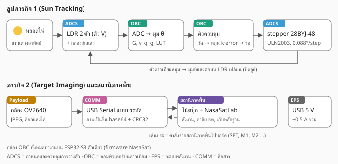

| ระบบย่อย | ดาวเทียมจริง | NasaSat ของเรา |
|---|---|---|
| ADCS (กำหนดและควบคุมการวางตัว) | sun sensor, magnetometer, gyro, star tracker / reaction wheel, magnetorquer | LDR 2 ตัววางเป็นตัว V + กล่องกันแสง / stepper 28BYJ-48 หมุนตัวดาวเทียม |
| OBC (คอมพิวเตอร์บนดาวเทียม) | flight software, FDIR, บันทึกข้อมูล | ESP32-S3 + firmware NasaSat (loop ไม่ block, งานยาวแบบ protothread, watchdog, ค่าตั้งเก็บใน flash) |
| EPS (พลังงาน) | แผงโซลาร์ แบตเตอรี่ ตัวจ่ายไฟ | ไฟ USB 5 V ตรวจไฟตก (brownout) ปล่อยขดลวดมอเตอร์ตอนหยุด |
| COMM (สื่อสาร) | วิทยุ, โปรโตคอลมี checksum, ส่งซ้ำ | USB Serial แบบบรรทัด, ภาพส่งเป็นชิ้นพร้อม CRC32 และขอชิ้นที่หายซ้ำ |
| Payload | กล้องถ่ายภาพโลก | กล้อง OV2640 (JPEG) ชี้ด้วยตัวขับเดียวกับภารกิจ 1 |
| สถานีภาคพื้น | จานรับส่ง + ห้องควบคุม | โน้ตบุ๊ก + NasaSatLab (สั่งงาน คาลิเบรต เก็บหลักฐาน) |

### 1.3 หลักคิด 3 ข้อที่ทำให้ระบบเราต่างจากโค้ดตัวอย่าง
1. **คำนวณมุมจากฟิสิกส์จริงของเซนเซอร์** ไม่ใช่เอาค่า ADC มาลบกันตรง ๆ ความสว่างหลอดที่เปลี่ยนจึงไม่ทำให้มุมเพี้ยน (หัวข้อ 3)
2. **ควบคุมแบบ "วัด → หมุน → รอ"** เพราะ LDR ตอบสนองช้า การหมุนไปวัดไปจะได้ค่าที่ล้าหลัง (หัวข้อ 6)
3. **ไม่รายงานว่าผ่านทั้งที่ไม่ผ่าน** ค่าที่ ADC ตัน ภาพที่หันไม่ถึงเป้า ภาพที่ส่งไม่ครบ ระบบบอกเหตุผลแทนการแกล้งทำว่าสำเร็จ และทุกอย่างมี log เป็นหลักฐาน (หัวข้อ 8)

> **พูดกับกรรมการ:** ดาวเทียมของเราทำครบ 5 ระบบย่อยบนบอร์ดเดียว ส่วนที่ต่างคือเราคำนวณมุมแสงจากโมเดลฟิสิกส์ของ LDR และคาลิเบรตกับของจริง แล้วควบคุมแบบรอให้เซนเซอร์นิ่งก่อนวัดทุกครั้ง

---

## 2. Sun sensor แบบตัว V

### 2.1 กฎโคไซน์
แสงจากหลอดที่อยู่ไกลเทียบกับขนาดเซนเซอร์เป็นลำแสงขนาน พื้นที่รับแสงแบน ๆ จะรับพลังงานเท่ากับพื้นที่ที่ "หันหน้าเข้าหา" ลำแสง คือพื้นที่จริงคูณ cos ของมุมตกกระทบ (มุมระหว่างลำแสงกับเส้นตั้งฉากของหน้าเซนเซอร์)

```
แสงที่รับได้ = A · cos(มุมตกกระทบ)      (ถ้ามุมเกิน 90° แสงมาจากด้านหลัง = 0)
```

A คือความสว่างของหลอดที่ตำแหน่งนั้น ซึ่งเราไม่รู้ค่าและอาจเปลี่ยนได้ (หลอดหรี่ ย้ายหลอด)

### 2.2 วาง LDR สองตัวเป็นตัว V แล้วหาสูตรมุม

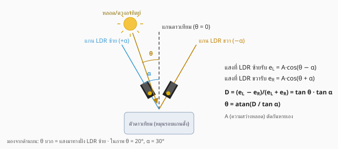

LDR ซ้ายเอียงออกจากแกนดาวเทียม +α และ LDR ขวาเอียง −α ถ้าแสงมาทำมุม θ กับแกน มุมตกกระทบของสองตัวคือ θ − α และ θ + α

```
e_L = A·cos(θ − α)          e_R = A·cos(θ + α)

ใช้สูตรผลบวกผลต่างของ cos:
e_L − e_R = A[cos(θ−α) − cos(θ+α)] = 2A·sin θ·sin α
e_L + e_R = A[cos(θ−α) + cos(θ+α)] = 2A·cos θ·cos α

D = (e_L − e_R) / (e_L + e_R) = tan θ · tan α
θ = atan( D / tan α )
```

A ตัดกันหายจากเศษและส่วน **มุมที่คำนวณจึงไม่ขึ้นกับความสว่างของหลอด** ถ้า e_L และ e_R เป็น "แสงจริง" (ไม่ใช่ค่า ADC ดิบ ดูหัวข้อ 3)

### 2.3 เลือกมุม α: ความไวแลกกับช่วงวัด

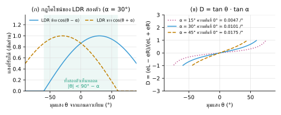

ความชันของ D ที่ θ = 0 คือ tan α (ต่อเรเดียน) ยิ่งชันยิ่งไว noise เท่ากันจะกลายเป็นมุมคลาดน้อยลง แต่ LDR ทั้งสองตัวต้องเห็นหลอดพร้อมกัน (cos > 0) จึงวัดได้แค่ |θ| < 90° − α

| α | ความชันที่ 0° (D ต่อองศา) | ช่วงวัดทางทฤษฎี | noise กลายเป็นมุม (เทียบ α = 30°) |
|---|---|---|---|
| 15° | 0.0047 | ±75° | แย่กว่า 2.2 เท่า |
| 30° (ของเรา) | 0.0101 | ±60° | 1 เท่า |
| 45° | 0.0175 | ±45° | ดีกว่า 1.7 เท่า |

ของจริงช่วงวัดแคบกว่านี้เพราะกล่องกันแสงบังขอบ (หัวข้อ 2.4) ในตัวจำลองที่กล่องตัดที่ 78° ช่วงที่วัดแม่นคือประมาณ −35° ถึง +40° ส่วนมุมที่อยู่นอกช่วง ระบบรู้ตัว (ธง edge) แล้วหมุนหยาบทีละ 30° เข้าหาแสงก่อน จึงไม่ต้องใช้ α เล็กเพื่อให้ช่วงกว้าง

### 2.4 กล่องกันแสง (baffle)
หน้าที่ 3 อย่าง
1. กันแสงจากด้านข้างและด้านหลัง เช่น ไฟเพดาน แสงสะท้อนจากโต๊ะ
2. กำหนดมุมมอง (field of view) ของ LDR แต่ละตัว
3. ทำให้รูปการตอบสนองของสองตัวเหมือนกัน

เรขาคณิตอย่างง่าย: ท่อที่ปากกว้าง w และ LDR อยู่ลึก h จากปาก แสงที่เข้ามาเฉียงเกินมุม φ_c จะถูกผนังบังจุดกลางของ LDR

```
tan φ_c ≈ (w/2) / h        ตัวอย่าง w = 10 mm: h = 5 mm → φ_c ≈ 45°,  h = 3 mm → φ_c ≈ 59°
เงื่อนไขที่ LDR ทั้งสองเห็นหลอดพร้อมกัน:  |θ| + α < φ_c   →  ช่วงวัด ≈ ±(φ_c − α)
```

หลักการออกแบบ: ด้านในทาดำด้าน, ซ้ายขวาเหมือนกันทุกมิติ, ยึดแน่นไม่ขยับ, α สองข้างเท่ากัน ถ้าต้องวัดได้ ±40° ด้วย α = 30° ต้องการ φ_c อย่างน้อยราว 70°
ความไม่สมบูรณ์ที่เหลือ (ขอบนุ่ม, สองข้างต่างกันเล็กน้อย) โมเดลจับด้วยเลขชี้กำลัง q ของแต่ละตัว และตาราง LUT (หัวข้อ 4)

> **พูดกับกรรมการ:** LDR สองตัวเอียงข้างละ α ตามกฎโคไซน์ได้ D = tanθ·tanα ความสว่างหลอดตัดกันหาย เราเลือก α = 30° เพราะไวพอและวัดได้กว้างพอ ส่วนนอกช่วงระบบหมุนหยาบเข้าหาแสงก่อน

---

## 3. LDR วงจร และ ADC

### 3.1 LDR (ตัวต้านทานไวแสง CdS)
ความต้านทานลดลงเมื่อแสงมากขึ้นตามกฎยกกำลัง (กราฟ log–log เป็นเส้นตรง)

```
R = R10 · (E / 10 lux)^(−γ)
```

- R10 = ความต้านทานที่ 10 lux (GL5528 ประมาณ 10–20 kΩ) แต่ละตัวต่างกันได้มาก
- γ ตามรุ่นใน datasheet GL55: GL5516 ≈ 0.5, GL5528 ≈ 0.6, GL5537-1 ≈ 0.6, GL5537-2 ≈ 0.7, GL5539 ≈ 0.8, GL5549 ≈ 0.9 และแต่ละชิ้นเบี่ยงจากค่าเหล่านี้ได้
- ตอบสนองช้า: ขึ้นราว 20 ms ลงราว 30 ms (ในที่มืดช้ากว่านี้) ต้อง**รอหลังหมุน**ก่อนวัด และหลัง**ปิดหลอด**ต้องรอให้ค่านิ่งก่อนวัดแสงห้อง

เพราะแต่ละตัวต่างกัน (R10, γ, ตำแหน่ง, กล่อง) เราจึงคาลิเบรตแยกทีละตัว ไม่สมมติว่าสองตัวเหมือนกัน

### 3.2 วงจรแบ่งแรงดัน → conductance
LDR ต่อฝั่ง 3.3 V และตัวต้านทานคงที่ R_f ต่อลง GND (sen.topo = 0)

```
V = Vcc · R_f / (R_f + R)

จัดรูป:   V / (Vcc − V) = R_f / R  ≡  G     (conductance สัมพัทธ์ ไม่มีหน่วย)
ถ้า LDR อยู่ฝั่ง GND (sen.topo = 1):   G = (Vcc − V) / V

เพราะ R ∝ E^(−γ)   →   G ∝ E^γ   →   E ∝ G^(1/γ)
```

สูตรนี้ใช้ได้โดย**ไม่ต้องรู้ค่า R_f** รู้แค่ Vcc และว่า LDR อยู่ฝั่งไหน (ทดสอบง่าย ๆ: เอามือบังแล้ว mV ลด = LDR ฝั่ง 3.3 V)

### 3.3 เลือก R_f ให้ไวที่สุด

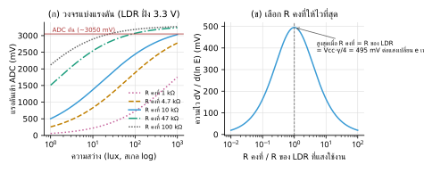

ความไวของแรงดันต่อแสง (คิดเป็นการเปลี่ยนแปลงแบบร้อยละของแสง) คือ

```
dV / d(ln E) = Vcc · γ · x / (1 + x)²      โดย x = R_f / R_LDR ที่แสงใช้งาน
สูงสุดเมื่อ x = 1 :  Vcc·γ/4 = 3300 × 0.6 / 4 = 495 mV ต่อแสงเปลี่ยน e เท่า  (≈ 47 mV ต่อแสงเพิ่ม 10%)
```

- R_f เล็กไป: แรงดันต่ำ ความละเอียดหาย
- R_f ใหญ่ไป: แสงแรงแล้วแรงดันชนเพดาน ADC (~3050 mV คือ G ≥ 12.2) ค่าที่ตันใช้ไม่ได้ (หัวข้อ 3.8)
- ถ้าบอร์ดผู้จัดใส่ R_f มาแล้วเปลี่ยนไม่ได้: ปรับระยะหลอด หรือปิดกระดาษบางบนคู่ LDR **ให้เท่ากันทั้งสองตัว** แล้วคาลิเบรตใหม่

### 3.4 ADC ของ ESP32-S3
- ADC แบบ SAR 12 บิต ตั้ง attenuation สูงสุดจะอ่านได้ราว 0–3.1 V ใช้ `analogReadMilliVolts()` ที่แก้ค่าด้วยข้อมูลคาลิเบรตจากโรงงาน ได้ผลเป็น mV ตรง ๆ
- ช่วงใกล้ 0 V และใกล้เพดานไม่เชิงเส้นและตัน เราจึงถือว่า ≥ 3050 mV คือตัน
- ใช้ขา ADC1 (GPIO1–10) เป็นหลัก เพราะ ADC2 ชนกับ Wi-Fi
- noise ราวไม่กี่ mV ต่อครั้งอ่าน ลดด้วยการเฉลี่ย N ครั้ง (ลดลง √N เท่า) firmware อ่านสลับ L, R, R, L ให้เวลาเฉลี่ยของสองช่องตรงกัน เฉลี่ยทุก 20 ms และหนึ่งการวัดใช้ 60 ms (ประมาณ 54 คู่)

ในตัวจำลอง ใกล้ θ = 0 แรงดันเปลี่ยน 1 mV ทำให้มุมเปลี่ยน 0.09° noise 4 mV ต่อครั้งอ่านจึงเหลือ 0.07° หลังเฉลี่ย (ถ้าอ่านครั้งเดียวคือ 0.5°)

### 3.5 ทำไมห้ามใช้ค่า ADC ดิบ

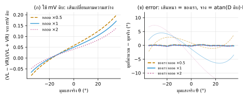

แรงดันจากวงจรแบ่งแรงดันไม่เป็นสัดส่วนกับแสง (เป็นรูป S บนแกน log ของแสง) ถ้าเอา mV ซ้ายลบขวาหารผลบวก ความสว่างของหลอดจะไม่ตัดกัน กราฟ D–มุมเลื่อนทุกครั้งที่หลอดหรี่หรือสว่างขึ้น
ทางของเรา: mV → G → G^(1/γ) (ได้แสงจริง) → ลบแสงห้อง → ถอดราก q → D → θ ขั้นตอนนี้ทำให้ e_L, e_R เป็นแสงจริง สูตรในหัวข้อ 2.2 จึงใช้ได้

ตัวอย่างจากการจำลอง (คาลิเบรตที่ความสว่าง 1 เท่า แล้วเปลี่ยนความสว่างหลอด):

| หลอด | วิธีดิบ atan(D)·k (คาลิเบรตแล้ว) | วิธีของเรา |
|---|---|---|
| ×0.5 | คลาดเฉลี่ย 1.6° | 0.13° |
| ×2 | คลาดเฉลี่ย 7.4° | 0.15° |

ตารางนี้เป็นกรณีกล่องครอบสองข้างเหมือนกันในห้องเกือบมืด ถ้ากล่องครอบไม่เท่ากันหรือห้องเปิดไฟ ต้องวัด γ สองระดับแสงเพิ่ม (หัวข้อ 4.8) ไม่งั้นคลาดได้ 0.5–4°

### 3.6 แสงห้อง (ambient) และ γ ของแต่ละตัว
LDR รับแสงหลอดบวกแสงห้องรวมกัน แล้วจึงผ่านกฎยกกำลัง γ

```
G_i = c_i · (E_หลอด + E_ห้อง)^γ_i

แสงหลอดล้วน:  E_หลอด ∝ G_i^(1/γ_i) − a_i       โดย a_i = G_ห้อง,i^(1/γ_i) วัดตอนปิดหลอด (AMB)
```

- ต้องลบแสงห้องใน "หน่วยแสง" (หลังยกกำลัง 1/γ) ไม่ใช่ลบ mV หรือลบ G
- ใช้ γ ผิดจะลบแสงห้องไม่หมด ตัวอย่าง γ จริง 0.62 แต่ใช้ 0.57 กับแสงห้อง 30% จะคลาด 7.6% ของแสงหลอด ทีมจึงให้การ Fit หา γ ของแต่ละตัวเมื่อวัดแสงห้องแล้ว (ในการทดสอบช่วยเพิ่มราว 0.02–0.03° เท่านั้น เพราะ q ชดเชยส่วนใหญ่ไว้แล้ว)
- **AMB ต้องรอให้ LDR นิ่ง** หลังปิดหลอด LDR ค่อย ๆ มืดลง ถ้าวัดทันที แสงห้องจะสูงเกินจริงราว 35% (เจอจากการทดสอบ firmware) firmware จึงวัดทีละ 250 ms จนสองครั้งติดกันต่างกันไม่เกิน 1%

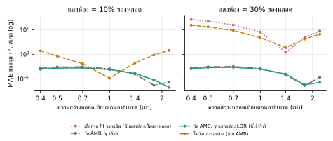

บทเรียนจากห้องสว่าง (แสงห้อง 30% ของหลอด, จำลอง):
- **ข้ามการวัด AMB**: คลาด 4.8° ที่ความสว่างเดิม และ 2–16° เมื่อความสว่างเปลี่ยน (หลอดหรี่ยิ่งแย่)
- **เลือกจุด Fit แบบนับแสงห้องเป็นแสงหลอด** (วิธีในเวอร์ชันแรกของเรา): โปรแกรมไปใช้จุดตรงขอบกล่องที่หลอดถูกบังแต่ยังสว่างจากไฟห้อง โมเดลเลยเพี้ยน คลาด 8° ที่ความสว่างเดิม และสูงสุด 27° ตอนนี้แก้เป็นหักแสงห้องออกก่อนเลือกจุด และมีชุดทดสอบกันพลาดซ้ำ
- **วัด AMB + เลือกจุดจากแสงหลอดล้วน**: คลาด 0.25–0.3° ทุกความสว่าง

### 3.7 ไฟกระพริบ 100 Hz

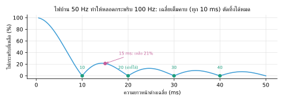

ไฟบ้าน 50 Hz ทำให้หลอดสว่างขึ้นลง 100 ครั้งต่อวินาที ค่าเฉลี่ยของคลื่น sin ในเวลา T คือ

```
ที่เหลือ = | sin(π f T) / (π f T) |       f = 100 Hz
T = 10, 20, 30 ms (เต็มคาบ) → 0    ·    T = 15 ms → เหลือ 21%
```

firmware จึงเฉลี่ยทีละ 20 ms นอกจากนี้ LDR เองก็กรองความถี่สูง (τ ≈ 25 ms ลดขนาดที่ 100 Hz เหลือ 1/√(1 + (2π·100·0.025)²) ≈ 6%) และไฟกระพริบเข้าสองตัวพร้อมกันจึงตัดกันใน D อีกชั้น ในตัวจำลองไฟกระพริบแรง 30% ทำให้มุมแกว่งแค่ 0.05°

### 3.8 ADC ตัน = ข้อมูลหลอก
ถ้าแสงแรงจนทั้งสองช่องชนเพดาน ค่าที่อ่านได้จะเท่ากันพอดี D = 0 ระบบที่ไม่ระวังจะคิดว่า "ตรงเป้าแล้ว" ทั้งที่อาจคลาดเป็นสิบองศา (ผู้ตรวจภายนอกเจอปัญหานี้ในเวอร์ชันแรก)
กติกาของเรา: มีค่าตันแม้ครั้งเดียวในหน้าต่าง → การวัดนั้น "ใช้ไม่ได้" ภารกิจ 1 จะไม่ประกาศล็อก ขึ้นเหตุผล `adc_saturated` และธง SAT ใน telemetry ให้ผู้ควบคุมแก้ที่ต้นเหตุ (ถอยหลอด, กระดาษบาง, เปลี่ยน R_f)

> **พูดกับกรรมการ:** เราไม่ใช้ค่า ADC ดิบ แต่แปลงเป็น conductance แล้วถอดราก γ ของ LDR แต่ละตัวให้ได้แสงจริง หักแสงห้องที่วัดตอนปิดหลอด แล้วค่อยคิด D ความสว่างหลอดจึงตัดกันจริง ทดลองเปลี่ยนความสว่างครึ่งหนึ่งถึงสองเท่า มุมคลาดยังไม่ถึง 0.2° ขณะที่วิธีดิบคลาดหลายองศา

---

## 4. การคาลิเบรต

### 4.1 สิ่งที่ไม่รู้และต้องหา
มุมเอียงจริงของ LDR (α), γ ของแต่ละตัว, ความไวที่ต่างกัน (gain g), รูปการตอบสนองของกล่อง (q แต่ละตัว), แสงห้อง (a แต่ละตัว), ทิศของหลอดเทียบศูนย์ตัวขับ (φ) และศูนย์สัมบูรณ์ของแกนดาวเทียม (th0)

### 4.2 ขั้นตอนและเหตุผล

| ขั้น | ทำ | เหตุผล |
|---|---|---|
| 1 | หันเข้าหลอดคร่าว ๆ แล้ว ZERO | ให้การกวาดครอบหลอดตรงกลาง |
| 2 | BACKLASH → ตั้ง act.bl แล้วค่อย SPR | มุมของตัวขับต้องถูกก่อน ข้อมูลกวาดจึงเชื่อได้ (SPR ก่อนตั้ง act.bl นับคลาดได้ถึง ~17 step เพราะจุดศูนย์สองครั้งอาจอยู่คนละฝั่งของระยะฟรีเฟือง) |
| 3 | ปิดหลอด → AMB | แสงห้องของแต่ละ LDR (รอให้นิ่งเอง) |
| 4 | เปิดหลอด → SWEEP −60..60 ทีละ 5° | เก็บรูปการตอบสนองจริง 25 จุด |
| 5 | Fit | หาค่าโมเดลทั้งหมด + ตาราง LUT |
| 6 | ตรวจด้วยจุดที่ไม่ได้ใช้ Fit | ดูความแม่นภายใน |
| 7 | ส่งค่าเข้าบอร์ด + SAVE | เก็บลง flash |
| 8 | ตั้งศูนย์กับของอ้างอิงภายนอก (CAL TH0) | แก้ศูนย์สัมบูรณ์ที่ขั้น 1–7 มองไม่เห็น (บอร์ดบันทึกค่านี้ลง flash ทันที) |

### 4.3 โมเดลที่ใช้ Fit

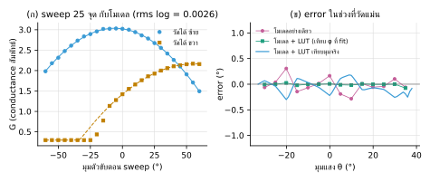

```
G_L(ang) = ( A_L · cos^qL(φ − ang − α) + a_L )^γL
G_R(ang) = ( A_R · cos^qR(φ − ang + α) + a_R )^γR
ang = มุมตัวขับตอนวัด,  φ = ทิศหลอดเทียบศูนย์ตัวขับ
```

- ค่าที่หา: φ, α, q_L, q_R, A_L, A_R, γ_L, γ_R (a_L, a_R ได้จาก AMB)
- วัดความคลาดเป็น log G เพราะ noise และความไม่แน่นอนเป็นแบบร้อยละ จุดสว่างและจุดมืดจึงมีน้ำหนักพอ ๆ กัน
- ใช้วิธี **Levenberg–Marquardt**: ขยับค่าทุกตัวพร้อมกันทีละนิดให้ผลรวมกำลังสองของความคลาดลดลง ไกลคำตอบทำตัวเหมือนเดินตามความชัน (ปลอดภัย) ใกล้คำตอบทำตัวเหมือน Gauss–Newton (เร็ว) ปรับสมดุลเองอัตโนมัติ
- เริ่มจากหลายค่า α (±30°, ±20°, ±45°) กันติดคำตอบผิด (α ติดลบ = ต่อสายซ้ายขวาสลับ โปรแกรมจัดการให้)
- ใช้เฉพาะจุดที่แสงหลอดล้วน ≥ 30% ของจุดสว่างสุดของช่องนั้น (หักแสงห้องก่อน) กันขอบกล่องที่โมเดลไม่ได้รวมไว้
- γ ถูกดึงเบา ๆ เข้าหาค่า datasheet ถ้าข้อมูลบอกไม่ชัดจะไม่วิ่งไปค่าแปลก

ผลจำลอง (หลอด 25°, LDR จริง γ 0.62/0.57, α 31.0°/30.6°): rms ของ log G = 0.0026, ได้ α = 30.96°, γ = 0.609/0.572

### 4.4 จากโมเดลเป็นตัวคำนวณมุมบนบอร์ด

```
e_L = ( G_L^(1/γL) − a_L )^(1/qL)            = A_L^(1/qL) · cos(θ − α)
e_R = ( G_R^(1/γR) − a_R )^(1/qR) / g        = A_L^(1/qL) · cos(θ + α)
g   = A_R^(1/qR) / A_L^(1/qL)
D   = (e_L − e_R)/(e_L + e_R)  →  θ = atan(D / tan α) + th0 + LUT
```

ลำดับสำคัญ: **คูณ gain หลังถอดราก q** ถ้าคูณก่อน ศูนย์จะเลื่อนราว 6° (บั๊กที่เราเจอตอนพัฒนา)

### 4.5 ตาราง LUT
ส่วนที่โมเดลยังอธิบายไม่ครบ (ขอบกล่องนุ่ม ความไม่สมมาตรเล็กน้อย) แก้ด้วยตารางค่าแก้ทุก 1° ของมุมดิบ
- สร้างจากความสัมพันธ์ "มุมดิบ → มุมจริง" ของจุดกวาดที่บังคับให้เพิ่มขึ้นทางเดียว (isotonic regression) กันตารางสลับไปมาจาก noise
- บนบอร์ดใช้การประมาณค่าเชิงเส้นระหว่างช่อง ความละเอียด 0.001°
- ผลจำลอง: ความคลาดในช่วงที่วัดแม่นลดจากหลักสิบของ 0.1° ลงเหลือระดับ 0.01°–0.1°

### 4.6 กับดักศูนย์สัมบูรณ์ และ CAL TH0
ขั้นตรวจ (ขั้น 6) ใช้ทิศหลอด φ ที่ได้จากการ Fit เป็น "เฉลย" ถ้า φ เพี้ยนไปคงที่ (เพราะ LDR สองตัวติดเอียงไม่เท่ากัน กล่องไม่สมมาตร หรือโมเดลคลาดเล็กน้อย) ทุกจุดจะเพี้ยนเท่ากัน **ขั้นตรวจจึงมองไม่เห็นเลย**
ใน firmware ตัวจริงในโลกจำลอง หลังขั้น 1–7 มุมคลาดคงที่ −0.37° (กระจายแค่ 0.06°) ขั้นตรวจบอกว่าแม่นมาก แต่จริง ๆ คลาดทั้งชุด

ทางแก้เดียวคือ**ของอ้างอิงภายนอก** 1 ตำแหน่ง เช่น หลอดดูดเล็ง, เส้นเล็งบนโต๊ะ, ไม้โปรแทรกเตอร์ หรือให้หลอดอยู่กลางภาพกล้อง แล้วสั่ง

```
CAL TH0 θ_อ้างอิง        →   th0 ใหม่ = th0 เดิม + θ_อ้างอิง − θ_ที่อ่านได้
```

หลัง CAL TH0 ในโลกจำลอง มุมคลาดเฉลี่ยเหลือราว 0.05–0.09° สูงสุด 0.1–0.26° แล้วแต่ noise (เทียบกับมุมจริง ทั้งหมุนเข้าจากซ้ายและขวา) ของจริงจะถูกจำกัดด้วยความแม่นของของอ้างอิง (ท่อเล็งยาว 20 cm ราว ±0.3°, โปรแทรกเตอร์ด้วยตาราว ±0.5–1°)

### 4.7 เทียบวิธีคำนวณมุม (ข้อมูลกวาดชุดเดียวกัน, จำลอง)

| วิธี | คลาดเฉลี่ยบนข้อมูลคาลิเบรต |
|---|---|
| เส้นตรงจากผลต่าง mV ดิบ | 3.35° |
| atan(D ดิบ) × k | 4.48° |
| โมเดลฟิสิกส์ของเรา | 0.49° |
| โมเดลฟิสิกส์ + LUT | 0.016° |

ตัวเลขบนข้อมูลคาลิเบรตเองย่อมดูดีเกินจริง ตัวเลขที่ควรเชื่อคือเทียบกับมุมจริงที่จุดอื่น: MAE 0.11° สูงสุด 0.30° (จำลอง, ก่อนตั้งศูนย์)

### 4.8 หลอดหรี่ ระยะเปลี่ยน แล้วมุมต้องไม่เปลี่ยน: γ สองระดับแสง
หลังถอดราก ค่าของแต่ละช่องแปรตามความสว่างหลอด K แบบยกกำลัง

```
e_i ∝ K^( γ_i,จริง / (γ_i,ที่ใช้ × q_i,ที่ใช้) )        D ตัด K ทิ้งได้ก็ต่อเมื่อเลขชี้กำลังของสองช่องเท่ากัน
```

ปัญหา: การกวาดที่ความสว่างเดียวรู้แค่**ผลคูณ** γ·q ของแต่ละช่อง (γ มากขึ้น q น้อยลงได้เส้นเดียวกัน)
- ห้องมืด: ผลคูณที่ fit ตรงทำให้เลขชี้กำลังเหลือ 1/q_จริง ของแต่ละช่อง ตัดกันได้ก็ต่อเมื่อ**กล่องครอบสองข้างรูปทรงเหมือนกัน** กล่องที่ทำมือมักไม่เหมือนกันเป๊ะ ในตัวจำลอง q 1.25/1.45 หลอดเปลี่ยน 0.5–2 เท่า ศูนย์เลื่อน 3–4°
- ห้องเปิดไฟ: ต้องลบแสงห้องด้วย γ ของแต่ละตัว ถ้าสัดส่วน γ_ที่ใช้/γ_จริง ของสองช่องไม่เท่ากัน แสงห้องเหลือไม่เท่ากัน ศูนย์เลื่อนแม้กล่องเหมือนกัน (ตัวจำลอง: 0.5° เมื่อหลอดหรี่เหลือ 0.45 เท่า)

ทางแก้: หันหน้าเข้าหลอดแล้ววัดสองครั้งที่ท่าเดิม ครั้งที่สองเอากระดาษขาวบังหน้า**หลอด**ให้แสงลดลง s เท่า (ไม่ต้องรู้ค่า s) แสงหลอดล้วนของทั้งสองช่องต้องลดลงเท่ากัน

```
(G_L1^(1/γL) − a_L) / (G_L2^(1/γL) − a_L)  =  (G_R1^(1/γR) − a_R) / (G_R2^(1/γR) − a_R)      แก้หา γR เมื่อรู้ γL
ห้องมืด:   γR / γL = ln(G_R1/G_R2) / ln(G_L1/G_L2)
```

แล้ว fit โดยล็อกอัตราส่วน γR/γL ตามที่วัด และใช้ q ค่าเดียวกันทั้งสองช่อง เลขชี้กำลังของสองช่องจึงเท่ากันพอดีไม่ว่ากล่องจะเป็นแบบไหน ส่วนรูปทรงที่ต่างกันกลายเป็นความคลาดคงที่ที่ตาราง LUT แก้ให้ (ตรวจด้วย `check_formulas.py` ข้อ 15–16)

| สถานการณ์ (จำลอง) | ไม่วัด γ สองระดับ | วัด γ สองระดับ |
|---|---|---|
| กล่องเหมือนกัน ห้องเกือบมืด หลอด ×0.45 (firmware จริง) | เซนเซอร์เพี้ยน 0.5° | −0.03 ถึง 0.09° |
| กล่องไม่เท่ากัน (q 1.25/1.45) ห้องสว่าง 30% หลอด ×0.5 / ×1.8 | ภารกิจ 1 คลาด +3.6° / −3.3° | 0.09° / 0.09° |
| 8 โลก (กล่อง 1.35/1.35 ถึง 1.2/1.6, ห้อง 3% และ 30%) หลอด 0.25–4 เท่า | ศูนย์เลื่อนสูงสุด 14° | ≤ 0.4° |
| ไฟห้องเปลี่ยน 3% ↔ 30% หลังคาลิเบรต ไม่ทำอะไร | ≤ 1.9° | ≤ 0.33° |

กติกาตอนวัด (จากการทดลองความไว)
- แสงต้องลดลงอย่างน้อย 2 เท่า (ลดแค่ 1.4 เท่า คลาดได้ 2.4°) โปรแกรมไม่ยอมคำนวณถ้าน้อยกว่านี้
- รอให้ LDR นิ่งก่อนวัด (วัดตอนนิ่งไป 90% คลาด 1.7°) โปรแกรมวัดซ้ำจนสองครั้งติดกันต่างกันไม่เกิน 0.3%
- ห้ามขยับดาวเทียมระหว่างสองครั้ง (โปรแกรมเช็กมุมตัวขับ) บังที่หลอด ไม่ใช่ที่ LDR
- ค่านี้เป็นของคู่ LDR วัดครั้งเดียวต่อชุด ใช้ได้กับทุกหลอดและทุกห้อง

ไฟห้องเปลี่ยนทีหลัง: **อย่าวัดแสงรอบข้าง (AMB) ใหม่อย่างเดียว** ถ้าไม่มี γ สองระดับ ทดลองแล้วแย่ลงได้ถึง 3.1° ให้ตรวจศูนย์ด้วยท่อเล็งแล้ว CAL TH0 ใหม่ ถ้ามีเวลาค่อยคาลิเบรตใหม่ทั้งชุด

> **พูดกับกรรมการ:** เรากวาดตัวดาวเทียม 25 มุมแล้ว fit โมเดลฟิสิกส์ของ LDR แต่ละตัวด้วย Levenberg–Marquardt เก็บความคลาดที่เหลือในตาราง LUT และเพราะการคาลิเบรตตัวเองหาศูนย์สัมบูรณ์ไม่ได้ เราตั้งศูนย์กับของอ้างอิงภายนอกอีกขั้น
> และเพราะการกวาดที่ความสว่างเดียวแยก γ กับรูปทรงกล่อง q ไม่ออก เราวัดอัตราส่วน γ ของสอง LDR จากแสงสองระดับ ทำให้ความสว่างหลอดตัดกันหายจริงในสูตร หลอดหรี่หรือย้ายระยะ มุมก็ไม่เพี้ยน

---

## 5. งบความคลาดเคลื่อน (error budget)

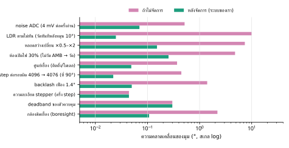

| แหล่ง | ถ้าไม่จัดการ | เราจัดการอย่างไร | เหลือ |
|---|---|---|---|
| noise ADC (4 mV ต่อครั้งอ่าน) | 0.5° | เฉลี่ย 54 คู่ต่อการวัด | 0.07° |
| LDR ตามไม่ทัน (วัดทันทีหลังหมุน 10°) | 10° | รอ 150 ms = 6τ | 0.025° |
| หลอดสว่างเปลี่ยน ×0.5–×2 | 7.4° (วิธีดิบ) | conductance + γ + หักแสงห้อง | 0.15° |
| ห้องเปิดไฟ 30% | 4.8° (ไม่วัด AMB) | AMB รอนิ่ง + เลือกจุดจากแสงหลอด | 0.25° |
| ศูนย์เยื้อง (ติดตั้ง/โมเดล) | 0.37° | CAL TH0 กับของอ้างอิง | ~0.05° |
| step ต่อรอบผิด (ใช้ 4096 แทน 4076) | 0.45° ที่ 90° | คำสั่ง SPR | ~0.02° |
| backlash เฟือง 1.4° | 1.4° | ชดเชย + เข้าเป้าจากทิศเดียว | ~0.05° |
| ความละเอียด stepper | 0.044° | — | 0.044° |
| deadband ของตัวควบคุม | 0.3° | ตั้งได้ (ctl.db) | 0.3° |
| กล้องติดเยื้อง | 2.2° (จำลอง) | วัด boresight → cam.off | ~0.1° (1 pixel) |

รวมแบบรากผลรวมกำลังสองสำหรับภารกิจ 1 ≈ **0.35°** ตัวใหญ่สุดคือ deadband ซึ่งเป็นค่าที่เราเลือกเอง (ถ้าเกณฑ์กรรมการเข้ม ลด ctl.db เป็น 0.15° ได้ถ้า noise ของจริงต่ำพอ) ตัวเลขทั้งหมดเป็นผลจำลองหรือการคำนวณ **ของจริงต้องวัดด้วยของอ้างอิงภายนอก** (TEST_PLAN ข้อ B7–B8)

> **พูดกับกรรมการ:** เราไล่แหล่งความคลาดทุกตัวตั้งแต่ noise, ความหน่วงของ LDR, แสงห้อง, ตัวขับ ไปจนถึงกล้อง แต่ละตัวมีวิธีจัดการและตัวเลขก่อนหลัง รวมแล้วราว 0.35° ซึ่งส่วนใหญ่มาจาก deadband ที่เราตั้งใจเลือก

---

## 6. การควบคุม

### 6.1 ตัวขับ stepper 28BYJ-48 + ULN2003
- มอเตอร์ 32 step ต่อรอบ แบบ half-step 64 ต่อรอบ ผ่านเฟืองทด (31·32·26·22)/(11·10·9·9) = **63.684 : 1** (ไม่ใช่ 64 ตามที่ขายกัน) → **4075.8 half-step ต่อรอบ** = 0.0883° ต่อ step
- คำสั่ง SPR วัดค่านี้จริง: หาจุดศูนย์ของแสง หมุน 360° แล้วหาจุดศูนย์อีกครั้ง นับ step ที่ใช้ (ในตัวจำลองได้ 4077 จากค่าจริง 4076)
- ลำดับขดลวด half-step 8 จังหวะ (1, 1+2, 2, 2+3, 3, 3+4, 4, 4+1) หมุนเร็วเกินราว 500–1000 step/s จะหลุด step จึงเร่ง/ลดความเร็วแบบคางหมู และจำกัดความเร็ว (act.vmax 40°/s)
- step ถูกสร้างจาก timer ทุก 200 µs แยกจาก loop หลัก มอเตอร์จึงเดินเรียบแม้ระหว่างถ่ายภาพ
- ตอนหยุดปล่อยไฟขดลวด (ประหยัดไฟ ลดความร้อน ลด noise) เฟืองทดมีแรงเสียดทานพอให้ค้างตำแหน่ง
- ทางเลือก servo: PWM 50 Hz พัลส์ 500–2500 µs ใช้ความละเอียด 14 บิต (ขีดของ ESP32-S3) = 1.2 µs ต่อหน่วย ≈ 0.11° ต่อหน่วย

### 6.2 backlash ของเฟือง

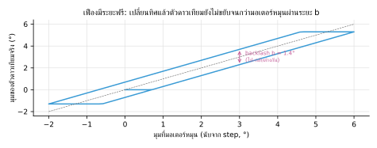

- วัดด้วยคำสั่ง BACKLASH: ปิดการชดเชย กวาดเข้าจุดศูนย์ของแสงจากทางซ้ายและทางขวา ผลต่างของสองจุดคือ b (ตัวจำลอง: วัดได้ 1.36° จากค่าจริง 1.40°)
- แก้ 2 ชั้น: (1) เวลากลับทิศ มอเตอร์หมุนเพิ่ม b ก่อน (act.bl) (2) ตอนเข้าเป้า ถ้าต้องหมุนกลับทิศไม่กี่องศา ให้เลยไป 1.5° แล้วค่อยเข้าจากทิศเดิมเสมอ (ctl.appr) ตำแหน่งสุดท้ายจึงซ้ำได้ ภารกิจ 2 (M2 GO) ก็เข้าเป้าทิศเดียวกันนี้ (เลยไป 2° ถ้าต้องหมุนกลับ)
- การชดเชยนับ "step ชดเชยที่ทำไปแล้ว" off (มอเตอร์ − ตำแหน่งที่นับ) ไว้เสมอ: หมุนทาง + ต้องการ off = 0 หมุนทาง − ต้องการ off = −b แล้วเติมเฉพาะส่วนที่ขาด ถ้าเคยปิดการชดเชยไประยะหนึ่ง (วัด BACKLASH ซ้ำ, เปลี่ยน act.bl) วิธีเดิม "เติม b ทุกครั้งที่กลับทิศ" อาจทำให้ตัวดาวเทียมเลื่อนจากตัวนับไป b ถาวร วิธีนี้เติมส่วนที่ขาดแล้วกลับมาตรงเอง (ตัวจำลอง: ก่อนแก้เลื่อน 1.4° หลังแก้ 0.00°)

```
ต้องการ:  หมุน +  → off = 0      หมุน −  → off = −b
เติม (step ที่ไม่นับเป็นการเคลื่อนที่):  หมุน +  : max(0, −off)      หมุน −  : max(0, off + b)
ผล: มุมตัวดาวเทียม = ตัวนับ − b/2 เสมอ ไม่ว่าเคยปิดการชดเชยมาก่อนหรือไม่
```

### 6.3 ทำไมต้อง "วัด → หมุน → รอ"
LDR ตามแสงไม่ทัน (τ ≈ 25 ms) และระหว่างมอเตอร์หมุน ค่าที่อ่านได้คือแสงของตำแหน่งเมื่อสักครู่ ถ้าคุมแบบต่อเนื่องจะแกว่ง เราจึงแก้มุมเป็นรอบ ๆ

```
1. รอ ctl.wait = 150 ms (6τ เหลือค่าค้างแค่ 0.25%)
2. วัดเฉลี่ย ctl.meas = 60 ms
3. error = θ − มุมเป้า
4. หมุน k · error  (k = ctl.k = 0.85, จำกัดไม่เกิน ctl.maxstep)
5. รอมอเตอร์หยุด แล้วกลับไปข้อ 1
```

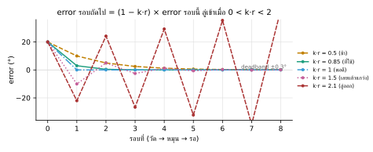

ถ้าตัวคำนวณมุมให้ค่าเป็น 1/r เท่าของมุมจริง (r = 1 คือคาลิเบรตพอดี)

```
error รอบถัดไป = (1 − k·r) × error รอบนี้
ลู่เข้าเมื่อ 0 < k·r < 2      ·      k = 0.85 จึงทนการคาลิเบรตคลาดได้ถึง r ≈ 2.35
จาก 75° เหลือ 0.3° ใช้ประมาณ ln(0.3/75)/ln(0.15) ≈ 3 รอบ
```

k = 1 เร็วที่สุดถ้าคาลิเบรตพอดี แต่ถ้าค่าจริงไวกว่าที่คิดจะเลยเป้าแล้วแกว่ง k = 0.85 ช้ากว่านิดเดียวแต่ปลอดภัยกว่า

### 6.4 การล็อกเป้า ไม่ให้ส่าย
- **deadband** ±0.3° (ctl.db): อยู่ในช่วงนี้ไม่ต้องขยับ
- **ติดกัน 3 ครั้ง** (ctl.nlock) จึงประกาศ HOLD กันโชคช่วยครั้งเดียว
- **hysteresis** 1° (ctl.hys): ล็อกแล้วจะกลับไปปรับเต็มรูป (FINE) เมื่อคลาดเกิน 1° เท่านั้น noise เล็ก ๆ จึงไม่ทำให้มอเตอร์กระตุกตลอดเวลา
- **trim ขณะล็อก** (ctl.trim = 3): ถ้าคลาดเกิน deadband ติดกัน 3 ครั้ง (ไม่ใช่ noise ครั้งเดียว) ขยับแก้ด้วยค่าเฉลี่ยของ 3 ครั้งนั้นโดยยังล็อกอยู่ แก้กรณีหลอดถูกขยับนิดหน่อยหรือสายดึงตัวดาวเทียมในระยะฟรีของเฟือง ที่เดิมจะค้างคลาดได้เกือบ 1°
- **นอกช่วงแม่น** (|D| เกิน dmax): หมุนหยาบทีละ 30° เข้าหาแสง
- **ไม่เห็นแสง** (หลอดอยู่หลังดาวเทียม): หมุนต่อเนื่องไปทางที่เห็นแสงครั้งล่าสุด (หรือฝั่งที่เหลือมุมมากกว่า) อ่านค่าทุก 40 ms แล้วหยุดทันทีที่ค่าใช้ได้ ไม่ตัน และ**อยู่ในมุมที่ตัวขับหมุนไปถึงได้** (มุมแสงวนรอบได้แต่ตัวขับหมุนได้แค่ ±170° หลอดที่ −140° จะโผล่ "ทะลุด้านหลัง" ตอนหมุนไปทาง + ที่มุมที่หมุนไม่ถึง) ถ้าไม่เจอค่อยหมุนอีกฝั่ง วิธีเดิมหยุด-รอ-วัดทุก 20° ใช้ 20–29 วินาที วิธีนี้ 6–15 วินาที
- **แก้แล้วเลยเป้า**: ถ้าการแก้ปกติทำให้ error กลับเครื่องหมาย แปลว่าค่าที่อ่านไวเกินจริง (เช่น ยังไม่คาลิเบรต ค่าที่อ่าน ~1.6 เท่า) ลด k ลงครึ่งทุกครั้งที่เกิด จาก k·r > 1 จึงกลับมาลู่เข้า ไม่วนรอบเป้าไม่จบ
- **noise สูง** (ctl.adapt): ประมาณ noise จากผลต่างของหน้าต่างที่ติดกัน (ไม่นับการลอยช้า ๆ) ถ้า noise ของค่าที่ใช้ตัดสินเกิน 1/3 ของ deadband เฉลี่ยนานขึ้นเท่าตัว (สูงสุด 400 ms) ถ้ายังไม่พอขยาย deadband เป็น 2.5 เท่าของ noise เพื่อให้ยังล็อกได้ บอร์ดเงียบไม่เปลี่ยนอะไร

### 6.5 ทำไมไม่ใช้ PID เต็มรูป
stepper เป็นตัวขับแบบสั่ง "ตำแหน่ง" อยู่แล้ว ลูปที่สั่งเพิ่มมุมทีละ k·error จึงเท่ากับตัวควบคุม P ที่มีตัวสะสมในตัว ไม่เหลือความคลาดค้าง ไม่ต้องใช้พจน์ I (ซึ่งจะทำให้เลยเป้า) พจน์ D ต้องการการวัดที่เร็วและไม่หน่วง ซึ่ง LDR ให้ไม่ได้
ถ้ากรรมการให้ใช้ reaction wheel บนฐานหมุนอิสระ จะเป็นระบบคนละแบบ (คุมแรงบิด ต้องมี gyro และคุมอัตราหมุนแบบ PD) firmware ปัจจุบันยังไม่รองรับ (อยู่ในรายการความเสี่ยง)

### 6.6 ผลในตัวจำลอง (firmware ตัวจริง)
| สถานการณ์ | ผล |
|---|---|
| เริ่มห่างหลอด 75° | ล็อกใน 4.4 s คลาดจริง < 0.1° |
| หลอดอยู่หลังดาวเทียม +140° / −140° | หาเจอและล็อกใน 6.1 s / 14–15 s (วิธีเดิม 20–29 s) |
| ADC noise 25 mV ต่อ sample | ล็อกใน 3–10 s คลาดจริง ≤ 0.27° (วิธีเดิม 6–22 s หรือไม่ล็อกเลยเมื่อ deadband 0.15°) |
| ก่อนคาลิเบรตเซนเซอร์ (ค่าที่อ่าน ~1.6 เท่า) | ล็อกได้ใน 4 s |
| หลอดขยับเล็กน้อย 0.5–0.9° ขณะล็อก | แก้กลับโดยยังล็อกอยู่ (trim) |
| STEP 10° (ดันเบี้ยวแล้วดูการกลับ) | กลับเข้าเป้าใน 2.0 s (3 รอบ) |
| ถูกชน 12° | กลับเข้าเป้าเองใน 2.2 s |
| หลอดย้าย 30° | ตามทันใน 2.3 s |
| ADC ตันเพราะแสงแรงเกิน | ไม่ล็อก ขึ้น adc_saturated และกลับมาทำงานเองเมื่อแสงปกติ |

> **พูดกับกรรมการ:** เราใช้ตัวควบคุมแบบเป็นรอบ วัดหลัง LDR นิ่งแล้วหมุนแก้ 0.85 เท่าของ error ซึ่งพิสูจน์ได้ว่าลู่เข้าเมื่อ 0 < k·r < 2 มี deadband กับ hysteresis กันส่าย และจัดการ backlash ด้วยการชดเชยกับเข้าเป้าจากทิศเดียว

---

## 7. ภารกิจถ่ายภาพ

### 7.1 pixel กับมุม (กล้องรูเข็ม)

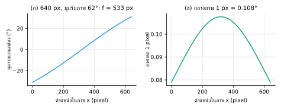

```
ระยะโฟกัสในหน่วย pixel:   f = (W/2) / tan(HFOV/2) = 320 / tan 31° = 533 px     (ภาพกว้าง 640 px, มุมรับภาพ 62°)
วัตถุห่างแกนกล้อง |δ| อยู่ห่างกลางภาพ   f·tan|δ|  pixel        กลางภาพ 1 pixel ≈ 0.108°
```

**ทิศของภาพ** ไม่ได้มีทางเดียว: วัตถุที่มุมตัวขับ "มากกว่า" อาจอยู่ซ้ายหรือขวาของภาพ แล้วแต่หมุนมอเตอร์ทางไหนเป็นบวกและกล้องติดแบบไหน (กลับหัว, กลับซ้ายขวา) เราจึงเขียนเป็น

```
มุมตัวขับของวัตถุที่ column x:     az = camAz + s · atan((W/2 − x) / f)
camAz = มุมที่แกนกล้องชี้ตอนถ่าย (= มุมตัวขับ + cam.off),    s = +1 ถ้าของที่มุมมากกว่าอยู่ซ้าย, −1 ถ้าอยู่ขวา
s = cam.dir × (−1 ถ้าภาพถูกกลับซ้ายขวาด้วย cam.hmirror)        (กลับบน-ล่าง vflip ไม่เปลี่ยน s)
```

ใช้ s ผิดด้าน = มุมที่ได้คลาดเป็น **สองเท่า** ของระยะจากกลางภาพ และ boresight ผิดเครื่องหมาย จึงต้องวัด cam.dir (ข้อ 7.8) ก่อนใช้ภาพหามุม

### 7.2 อ้างอิงอะไร: ศูนย์ตัวขับ หรือ ดวงอาทิตย์
- **เทียบศูนย์ตัวขับ** (M2 GO มุม): นับ step จากจุดที่ ZERO ถ้าตัวดาวเทียมถูกชนหรือเฟืองลื่นไป Δ องศา ภาพจะคลาด Δ ทั้งก้อน
- **เทียบดวงอาทิตย์** (M2 GO SUN offset): ทุกครั้งก่อนถ่าย หาทิศหลอดใหม่ด้วยเซนเซอร์ (หมุนหาจุดศูนย์ของแสง) แล้วหมุนไป "ทิศหลอด + offset" ความคลาดเหลือแค่ความคลาดของเซนเซอร์ที่จุดศูนย์ ไม่ขึ้นกับประวัติการหมุน
- ตัวจำลองหลังถูกชน 7°: เทียบศูนย์ตัวขับคลาด 6.4° เทียบดวงอาทิตย์คลาด 0.002°

### 7.3 boresight: กล้องไม่ได้ชี้ตรงแกนเซนเซอร์
ติดตั้งจริงกล้องเยื้องจากแกนเซนเซอร์เสมอ วัดโดยให้ภารกิจ 1 ล็อกหลอด (แกนเซนเซอร์ชี้หลอด) แล้วถ่าย หาจุดสว่างของหลอดในภาพ

```
cam.off = θ_ตอนถ่าย − δ_หลอดในภาพ,      δ = s · atan((W/2 − x_หลอด) / f)       (สูตรข้อ 7.1)
```

ต้องถ่ายตอนภารกิจ 1 ล็อก (HOLD) และ |θ| ≤ 2° เพราะค่าเซนเซอร์แม่นที่สุดที่จุดศูนย์ และต้องทำ**หลังตั้งศูนย์ CAL TH0** เพราะ cam.off วัดเทียบศูนย์ของเซนเซอร์ (ในตัวจำลองที่ยังไม่คาลิเบรต ศูนย์เพี้ยน 19° ได้ cam.off 21.5° แทน 2.2° ซึ่งถูกตามคณิตแต่ใช้ไม่ได้) เว็บรวมขั้นตอนเป็นปุ่มเดียว: เริ่มภารกิจ 1 รอล็อก ถ่าย แล้วคำนวณ

ตัวจำลองกล้องเยื้อง 2.2° ก่อนแก้คลาด 1.6° (ปนกับ backlash) หลังตั้ง cam.off เหลือ 0.6°

### 7.4 ภาพเบลอและการรอให้นิ่ง

```
เบลอ (pixel) = ความเร็วเชิงมุม × เวลารับแสง × f        ตัวอย่าง 40°/s × 30 ms → 1.2° → 11 pixel
```

firmware จึงถ่ายเมื่อมอเตอร์หยุดแล้วเท่านั้น รอ m2.settle (300 ms) โดยให้กล้องถ่ายทิ้งไปเรื่อย ๆ ให้ระบบปรับแสงอัตโนมัติเข้ากับภาพเป้า และทิ้งเฟรมเก่าอีก 2 เฟรมก่อนเก็บภาพจริง

### 7.5 แสงของกล้อง
กล้องปรับ exposure และ gain เอง (AEC/AGC) ถ้าหลอดอยู่ในภาพ ภาพส่วนอื่นจะมืด ถ้าต้องการให้ทุกภาพสว่างเท่ากันใช้ M2 LOCK ตรึงค่าหลังปล่อยให้ปรับจนนิ่ง metadata ของทุกภาพบอกว่าตรึงแสงอยู่หรือไม่

### 7.6 ส่งภาพให้ครบและถูก
- ตรวจหัว FFD8 และท้าย FFD9 ของ JPEG ก่อนส่ง
- ส่งเป็นชิ้นละ 480 ไบต์ (base64 640 ตัวอักษร) พร้อม CRC32 ของทั้งภาพ ผู้รับรวมชิ้นแล้วตรวจ CRC
- ชิ้นหาย: เว็บขอเฉพาะชิ้นที่หายซ้ำได้ 3 รอบ ถ้ายังขาดรายงาน "ภาพเสีย" แล้วใช้งานต่อได้ (ไม่ค้าง)
- base64 ทำให้ข้อมูลโต 4/3 เท่า ภาพ 640×480 ราว 25 KB → ข้อความ ~34 KB ผ่าน USB-UART 115200 baud ใช้ราว 3 วินาที ผ่าน USB ในตัว ESP32-S3 เร็วกว่ามาก ระหว่างส่ง STOP ยังตอบภายใน 20 ms (จำลอง)

### 7.7 กติกาการถ่ายของเรา
ภาพภารกิจจะถูกถ่ายเมื่อ (1) มุมที่ต้องหันอยู่ในช่วงที่หมุนได้ (2) หันได้คลาดไม่เกิน m2.tol (3) นิ่งแล้ว ถ้าไม่ครบ **ไม่ถ่าย** และบอกเหตุผล (`snap_fail: target_out_of_range / not_in_tol`) ถ้าต้องการภาพจริง ๆ สั่ง SNAP ถ่ายตรงนั้นได้ ซึ่ง metadata จะบอกชัดว่าไม่ได้หันเข้าเป้า

ตัวเลข `err_cmd` ใน metadata คือ "มุมที่สั่ง − มุมจากตัวนับ step" **ไม่ใช่ความคลาดที่วัดจริง** ความแม่นจริงต้องดูจากภาพ (เป้าอยู่ห่างกลางภาพกี่ pixel × 0.108°)

### 7.8 วัดทิศภาพและมุมรับภาพจากสองภาพ
ถ่ายภาพ A แล้วหมุนตัวขับ +D (8°) ทางเดียวกับที่เข้ามา (ไม่ให้ backlash กินมุม) แล้วถ่ายภาพ B ของที่อยู่นิ่งในห้องจะ "เลื่อน" ในภาพ
ถ้าเขียนตำแหน่งในภาพเป็น u = (x − W/2)/(W/2) ∈ [−1, 1] และ t = tan(HFOV/2) วัตถุที่ u ในภาพ A จะอยู่ที่

```
u' = tan( atan(u·t) + s·D ) / t        ในภาพ B
```

เว็บลองทุกคู่ (s = ±1, HFOV 20°–140° ทีละ 0.5°) นำภาพ A มาเลื่อนตามสูตรแล้วเทียบกับภาพ B ด้วยสหสัมพันธ์ของ **ความชันของความสว่างตามแนวนอน**
(เฉลี่ยแต่ละ column ก่อน ไม่ไวต่อ auto exposure ที่เปลี่ยนระหว่างสองภาพ) คู่ที่เข้ากันดีที่สุดให้ทั้งทิศ s และ HFOV จริงของกล้อง (ปรับละเอียดด้วยพาราโบลา)
ถ้าคะแนนต่ำกว่า 0.6 หรือห่างจากทิศกลับไม่ถึง 0.2 (ภาพผนังเรียบไม่มีอะไรให้เทียบ) โปรแกรม**ไม่สรุป** ไม่เดา

ทดสอบ: ฉากสังเคราะห์ทุกแบบได้ทิศถูกและ HFOV คลาด < 1° แม้ exposure ต่างกัน 0.7–1.4 เท่า ผนังเรียบถูกปฏิเสธ
ในเบราว์เซอร์กับตัวจำลอง (กล้องติดกลับหัว 180°, HFOV จริง 64°) ได้ทิศถูก HFOV 63.9°

### 7.9 คลิกบนภาพเพื่อเล็ง และสแกนรอบตัว
- คลิกจุดบนภาพ → มุมของจุดนั้นจากสูตรข้อ 7.1 → "หันไปถ่ายตรงนี้" (`M2 GO มุม`) หรือ "เทียบดวงอาทิตย์" (`M2 GO SUN มุม − ทิศดวงอาทิตย์`)
  ทิศดวงอาทิตย์เอามาจากภาพนั้น (ถ่ายแบบ GO SUN หรือมี θ ตอนถ่าย: ทิศ = มุมตัวขับ + θ) หรือตอนภารกิจ 1 ล็อกครั้งล่าสุด
- มุมที่ได้อ้างอิงกับ**ภาพนั้นเอง** cam.off และ backlash ที่ไม่ได้ชดเชยจึงหักล้างกัน ขอเพียงเข้าเป้าทิศเดียวกับตอนถ่าย (firmware บังคับให้แล้ว)
  ตัวจำลอง: คลิกเป้าในภาพสแกนแล้วถ่ายใหม่ เป้าอยู่ห่างกลางภาพ 0.2° (1 pixel ที่ 320 px ≈ 0.2°)
- สแกนรอบตัว: ถ่ายทุก ~70% ของ HFOV ตลอดช่วง act.min..act.max (ภาพซ้อนกัน เป้าไม่ตกช่อง) ใช้ภาพเล็ก 320×240 ให้เร็ว แล้วคลิกเป้า

> **พูดกับกรรมการ:** เราหันกล้องโดยอ้างอิงทิศดวงอาทิตย์ที่วัดใหม่ทุกครั้ง จึงไม่พังเมื่อตัวดาวเทียมถูกชน วัดทิศของภาพและมุมรับภาพจริงจากการหมุนระหว่างสองภาพ (ไม่เชื่อค่าในสเปก) แก้ boresight ด้วยการถ่ายหลอดตอนเซนเซอร์ล็อก ไม่รู้ว่าเป้าอยู่ไหนก็สแกนแล้วคลิกเป้าบนภาพได้ ถ่ายเมื่อหยุดนิ่งเท่านั้น และส่งภาพเป็นชิ้นพร้อม CRC32 ขอชิ้นที่หายซ้ำได้

---

## 8. OBC, FDIR, COMM, EPS

### 8.1 โครงสร้าง firmware (OBC)
- loop หลักไม่ block: ทุกรอบอ่านคำสั่ง, อ่านเซนเซอร์, เดินงานยาว, ส่งภาพ, ส่ง telemetry (20 ครั้ง/วินาที)
- งานยาว (กวาด, ภารกิจ 1, ภารกิจ 2, วัดแสงห้อง ฯลฯ) เขียนแบบ protothread: โค้ดอ่านจากบนลงล่างเหมือนปกติ แต่ทุกจุด "รอ" จะคืนการทำงานให้ loop แล้วกลับมาทำต่อรอบหน้า จึงไม่มีจุดไหนค้าง
- มี 2 ช่องงาน: ช่องหลัก (งานที่หมุนตัวดาวเทียม ทำทีละงาน) และช่องเสริม (วัดแสง, ถ่ายภาพตรงนั้น, ตรึงแสงกล้อง) คำสั่งที่ชนกันได้ `ERR BUSY` พร้อมชื่องานที่ขวางอยู่
- ค่าตั้ง 78 ค่าเก็บใน flash (NVS) ตั้งผ่านคำสั่ง SET แล้ว SAVE ไม่ต้องแก้โค้ดที่หน้างาน
- watchdog: ถ้า loop ค้างเกิน ~5 วินาที บอร์ดรีเซ็ตตัวเอง และรายงานสาเหตุรีเซ็ตตอนเปิดเครื่อง
- ทำงานเองได้โดยไม่ต้องมีคอม: เริ่มภารกิจ 1 เองหลังเปิดเครื่อง (m1.auto) ปุ่ม BOOT เริ่ม/หยุด และส่งข้อมูลสุขภาพระบบ (housekeeping) ทุก 2 วินาที: อุณหภูมิชิป, หน่วยความจำว่าง/ต่ำสุด, loop ที่ทำงานนานสุด (ใกล้ 5 วินาที = ใกล้ watchdog), แรงดันแบต

### 8.2 FDIR (ตรวจ แยก กู้คืน ความผิดพลาด)

| ความผิดพลาด | ตรวจพบจาก | ระบบทำอะไร |
|---|---|---|
| ADC ตัน | mV ≥ 3050 | การวัดใช้ไม่ได้, ไม่ล็อก, แจ้ง adc_saturated |
| ไม่เห็นแสง | แสงรวม S < minS | กวาดหาแสง, แจ้ง LOST no_light |
| นอกช่วงแม่น | \|D\| > dmax | หมุนหยาบ 30° ไม่ล็อกจากค่าขอบ |
| เป้าภาพเกินช่วงหมุน / คลาดเกิน tol | ตรวจก่อนและหลังหมุน | ไม่ถ่าย, snap_fail พร้อมเหตุผล |
| คำสั่งผิดช่วง | ช่วงค่าของค่าตั้ง | ERR RANGE (ไม่ใช้ค่าเก่าเงียบ ๆ) |
| ภาพขาดชิ้น | CRC32, จำนวนชิ้น | ขอส่งซ้ำ 3 รอบ แล้วรายงานภาพเสีย |
| loop ค้าง | watchdog | รีเซ็ต + รายงาน TASK_WDT |
| ไฟตก | brownout detector | รีเซ็ต + รายงาน BROWNOUT |
| servo ตั้ง PWM ไม่ได้ | ค่าที่คืนจากการ attach | แจ้ง FAULT ACT |
| กล้องเริ่มไม่ได้ | ค่า error ของ esp_camera | แจ้ง init fail พร้อมรหัส |
| ชุดขากล้องของชิปอื่น (จะทับขา flash) | ตรวจทุกขาก่อนเริ่มกล้อง | ไม่เริ่มกล้อง แจ้ง not for this chip บอร์ดไม่พัง |
| ปุ่มชนขากล้อง | ขาปุ่มอยู่ในรายการขากล้อง | ปิดปุ่ม แจ้ง WARN BTN |
| วิทยุช่องที่สองช้า/ค้าง | บัฟเฟอร์เต็ม | ทิ้งทั้งบรรทัด นับจำนวนที่ทิ้งใน hk, loop ไม่รอ |
| เว็บหลุดจากบอร์ดตอนรีเซ็ต | Web Serial แจ้งพอร์ตหาย | หาพอร์ตเดิม (VID:PID) ต่อใหม่และอ่านค่าใหม่เอง |

### 8.3 สื่อสาร (COMM)
- บรรทัด ASCII: ส่ง `@id คำสั่ง` บอร์ดตอบ `@id OK` หรือ `@id ERR รหัส` จึงจับคู่คำตอบกับคำสั่งได้เสมอ
- telemetry บอกหัวคอลัมน์เอง (`TH,...` ตามด้วย `T,...`) เพิ่มค่าใหม่ได้โดย tool ไม่พัง
- ข้อมูลโครงสร้างเป็น JSON (`J {...}`) เหตุการณ์ (`E ...`) แยกชัด
- ภาพ: ชิ้น + CRC32 + ขอส่งซ้ำเฉพาะชิ้น (หลักการเดียวกับ ARQ ในการสื่อสารดาวเทียมจริง)
- ช่องที่สอง (ไม่บังคับ): UART ต่อวิทยุ serial (HC-12, LoRa UART) หรือบอร์ดสะพาน ได้สำเนาทุกบรรทัดและรับคำสั่งได้ telemetry ช้าลงตามวิทยุ (2 Hz) บรรทัดรอในบัฟเฟอร์ ถ้าเต็มทิ้งทั้งบรรทัด (ผู้รับไม่เคยได้ครึ่งบรรทัด) ส่วนภาพรอที่ว่างทีละบรรทัดจึงครบเสมอ
  ตัวจำลอง วิทยุ 9600 baud: ภาพ 320×240 ใช้ 9.6 s, 640×480 ใช้ 32 s ครบทั้งสองฝั่ง และ loop ไม่เคยรอวิทยุ เปรียบเหมือน downlink ของดาวเทียมจริงที่ช้ากว่าบัสภายในมาก ต้องจัดลำดับและไม่ให้ downlink ทำให้ระบบอื่นค้าง

### 8.4 พลังงาน (EPS)

| อุปกรณ์ | กระแสโดยประมาณที่ 5 V |
|---|---|
| ESP32-S3 (ไม่เปิด Wi-Fi) | ~0.1 A |
| กล้อง OV2640 | ~0.1–0.15 A |
| 28BYJ-48 (ขดลวด ~50 Ω, half-step จ่ายไฟ 1–2 ขด) | ~0.1–0.2 A |
| รวม | ~0.45 A ใกล้ขีด USB 2.0 (0.5 A) |

ความเสี่ยงไฟตกตอนมอเตอร์หมุนพร้อมถ่ายภาพ ทางแก้: ปล่อยขดลวดตอนหยุด (ค่าเริ่ม), ใช้ USB hub ที่มีไฟเลี้ยง หรือแยกไฟ 5 V ให้ ULN2003 (ต่อ GND ร่วม), ดูสาเหตุรีเซ็ตทุกครั้งที่บอร์ดรีสตาร์ต

วัดแรงดันแบตได้ด้วยวงจรแบ่งแรงดันเข้าขา ADC: `V_แบต = V_ขา × (R_บน + R_ล่าง)/R_ล่าง` (hw.vdiv) แรงดันที่ขาต้องไม่เกิน ~3.1 V (ช่วง ADC) เช่นแบต 2S 8.4 V ใช้ 100k + 47k → ขาได้ 2.69 V ค่าออกใน housekeeping ทุก 2 วินาที

> **พูดกับกรรมการ:** flight software ของเราไม่มีจุดค้าง ใช้ protothread แยกงานยาว มี watchdog และตาราง FDIR ที่ทุกความผิดพลาดมีวิธีตรวจและวิธีตอบสนอง ภาพส่งเป็นชิ้นพร้อม CRC32 และขอส่งซ้ำได้แบบเดียวกับ ARQ

---

## 9. เชื่อมกับดาวเทียมจริง

- **Coarse sun sensor** บนดาวเทียมจริงคือ photodiode หรือเซลล์แสงอาทิตย์ที่ตอบสนองแบบโคไซน์ ติดทุกหน้าของดาวเทียม ความแม่นทั่วไปราว 3–5° ส่วน fine sun sensor แม่น 0.5° ถึง 0.01° ([CubeSat sensing guide](https://pressbooks-dev.oer.hawaii.edu/epet302/chapter/7-5/), [NSS CubeSat sun sensor ±0.5°](https://www.cubesatshop.com/product/nss-cubesat-sun-sensor/)) เซนเซอร์ตัว V ของเราคือ coarse sun sensor แบบ 1 แกน ที่ใช้การคาลิเบรตดันความแม่นลงไปต่ำกว่า 1° ในห้องทดลอง
- **ลูป ADCS จริง**: เซนเซอร์หลายชนิด (sun sensor, magnetometer, gyro, star tracker) → ตัวประมาณค่า (เช่น Kalman filter) → ตัวควบคุม → ตัวขับ (reaction wheel, magnetorquer) ของเรามีโครงเดียวกันแต่ย่อลง: LDR → ตัวคำนวณมุม → ตัวควบคุมเป็นรอบ → stepper
- **ดาวเทียมไทย**
  - **KNACKSAT** ของ มจพ. ดาวเทียมดวงแรกที่คนไทยสร้างเองทั้งดวง ขนาด 1U หนัก 1.3 kg ขึ้นสู่อวกาศ 3 ธ.ค. 2561 (2018) กับภารกิจ SSO-A บนจรวด Falcon 9 ([Gunter's Space Page](https://space.skyrocket.de/doc_sdat/knacksat.htm))
  - **THEOS-2** ดาวเทียมสำรวจโลกของ GISTDA สร้างโดย Airbus ถ่ายภาพละเอียด 50 cm ขึ้นสู่อวกาศด้วยจรวด Vega เที่ยว VV23 วันที่ 9 ต.ค. 2566 (2023) ตรงกับวันแข่งรอบชิงของเราพอดี 3 ปี ([Arianespace](https://newsroom.arianespace.com/vega-flight-vv23), [eoPortal](https://www.eoportal.org/satellite-missions/theos-2))
  - **Thaicom 7 และ 8** ดาวเทียมสื่อสาร ห้องควบคุมอยู่ที่สถานีภาคพื้นไทยคม ลาดหลุมแก้ว (ดูงานวันที่ 7 ต.ค.)

> **พูดกับกรรมการ:** coarse sun sensor บนดาวเทียมจริงแม่นราว 3–5° เราใช้หลักการเดียวกันแต่เพิ่มโมเดลฟิสิกส์และการคาลิเบรต จึงแม่นกว่า 1° ในห้องทดลอง

---

## 10. ผลการทดสอบ

### 10.1 ทำแล้ว (บนคอม ไม่มีฮาร์ดแวร์)

| ชุดทดสอบ | ผล |
|---|---|
| เว็บ tool + ตัวจำลองในเว็บ | 87/87 |
| firmware ตัวจริงกับโลกจำลอง (API core 3.x / 2.x) | 155/155 ทั้งสองแบบ ผ่าน noise 4 แบบ (seed) |
| firmware บน ESP32 รุ่นเก่า (บอร์ดกล้อง ESP32-CAM) | 15/15 |
| compile ด้วย esp32 core 3.3.5 ตัวจริง | ผ่าน 6 แบบ ไม่มี warning (S3 USB/UART, TinyUSB, ESP32-CAM, Fallback) |
| Fallback.ino | 11/11 |
| สูตรในเอกสารนี้ | 61/61 |

โลกจำลองมี: LDR สองตัวไม่เหมือนกัน (γ 0.62/0.57, R10 ต่างกัน, ติดเอียง 31.0°/30.6°), กล่องบังขอบ (และแบบกล่องสองข้างไม่เท่ากัน q 1.25/1.45), ความหน่วงขึ้น/ลงต่างกัน, ไฟกระพริบ 100 Hz, noise, ADC ตัน, มอเตอร์ที่หมุนตามสัญญาณขดลวดจริงที่ firmware ส่ง, step ต่อรอบ 4076, backlash 1.4°, กล้องเยื้อง 2.2°
ไม่มีในโลกจำลอง: แสงสะท้อน, หลอดที่ไม่ใช่จุด, สายไฟดึง, แรงเสียดทานจริง, ADC ไม่เชิงเส้นจริง, ไฟตกจริง, คุณภาพภาพจริง

### 10.2 ต้องทำกับบอร์ดจริง (กรอกผลลงตารางนี้)
ทำตาม `firmware/TEST_PLAN.md` ส่วน B เก็บ**ทุกครั้งรวมครั้งที่ล้มเหลว** และวัดมุมด้วยของอ้างอิงภายนอก

| ทดสอบ | เกณฑ์ภายในของทีม | ผลจริง |
|---|---|---|
| B7 มุมที่อ่านได้เทียบโปรแทรกเตอร์ (10 มุม สองทิศ) | MAE < 0.5°, สูงสุด < 1° | |
| B8 ภารกิจ 1 ซ้ำ 20 รอบจากมุมสุ่ม | ≥ 19/20 อยู่ในเกณฑ์ | |
| B6b บังหลอดด้วยกระดาษ (หรือถอยหลอด) แล้วล็อกใหม่ | มุมขยับ < 0.3° | |
| B10 ปิด/เปิดไฟห้อง (ไม่คาลิเบรตใหม่) | ศูนย์เลื่อน < 0.3° | |
| B12 ภาพเป้าหมาย GO SUN หลายมุม | เป้าห่างกลางภาพไม่เกินเกณฑ์ | |
| B15 มอเตอร์ + กล้องพร้อมกัน 20 ครั้ง | ไม่มี BROWNOUT | |

---

## 11. คำถามที่กรรมการน่าจะถาม

**เซนเซอร์และการคำนวณ**
1. *เซนเซอร์ทำงานอย่างไร* — LDR สองตัวเอียงข้างละ α รับแสงตามกฎโคไซน์ ได้ D = tanθ·tanα แล้ว θ = atan(D/tanα) ความสว่างหลอดตัดกันหาย
2. *ทำไม α = 30°* — ความชัน tanα ไวพอ (0.0101 ต่อองศา) และวัดได้ ±60° ตามทฤษฎี α ใหญ่ไวขึ้นแต่ช่วงแคบลง นอกช่วงเราหมุนหยาบเข้าหาแสงก่อน
3. *ทำไมไม่ใช้ ADC ดิบ* — วงจรแบ่งแรงดันไม่เชิงเส้น ความสว่างหลอดไม่ตัดกัน หลอดหรี่ครึ่งหนึ่ง/สว่างสองเท่าวิธีดิบคลาด 1.6–7.4° ของเรา 0.13–0.15° (จำลอง กล่องเหมือนกัน) ส่วนกรณีหลอดหรี่หรือย้ายระยะ: การกวาดที่ความสว่างเดียวแยก γ กับรูปทรงกล่องไม่ออก เราจึงวัดอัตราส่วน γ ของสอง LDR จากแสงสองระดับ (กระดาษบังหลอด) เลขชี้กำลังของสองช่องจึงเท่ากันและความสว่างตัดกันหายจริง ตัวจำลองที่กล่องไม่เท่ากัน: ไม่วัดคลาด 3–4° วัดแล้ว ≤ 0.13°
4. *แสงห้องจัดการอย่างไร* — วัดตอนปิดหลอด (รอ LDR นิ่ง) แล้วลบในหน่วยแสงหลังถอดราก γ ของแต่ละตัว ห้องสว่าง 30% ของหลอด ถ้าไม่วัดคลาดราว 5° และถึง 15° เมื่อหลอดหรี่ ถ้าวัดคลาดราว 0.3°
5. *ไฟกระพริบ* — เฉลี่ยทีละ 20 ms = 2 คาบของ 100 Hz ตัดทิ้งหมด LDR เองก็กรองอีกชั้น
6. *แสงแรงเกินล่ะ* — ADC ตันทำให้สองช่องเท่ากันหลอก ๆ เราถือว่าวัดไม่ได้ ไม่ล็อก และแจ้งให้ถอยหลอดหรือปิดกระดาษบาง

**คาลิเบรตและความแม่น**
7. *คาลิเบรตอย่างไร* — กวาด 25 มุม fit โมเดลฟิสิกส์ของ LDR แต่ละตัวด้วย Levenberg–Marquardt แล้วเก็บส่วนที่เหลือในตาราง LUT ใช้เวลาไม่ถึง 5 นาที
8. *รู้ได้อย่างไรว่าแม่นจริง* — ขั้นตรวจภายในใช้เฉลยจากการ fit เองจึงมองไม่เห็นความเยื้องคงที่ เราจึงตั้งศูนย์และตรวจกับของอ้างอิงภายนอก (ท่อเล็ง/โปรแทรกเตอร์) ทั้งหมุนเข้าจากสองทิศ
9. *ความคลาดมาจากไหนบ้าง* — ดูงบความคลาด (หัวข้อ 5) รวมราว 0.35° ส่วนใหญ่จาก deadband ที่เราเลือกเอง
10. *LDR สองตัวไม่เหมือนกันทำอย่างไร* — fit γ, q, gain และแสงห้องแยกทีละตัว และคูณ gain หลังถอดราก ไม่งั้นศูนย์เลื่อน 6°

**ควบคุมและตัวขับ**
11. *ทำไมไม่ใช้ PID* — stepper สั่งตำแหน่งอยู่แล้ว การสั่งเพิ่มทีละ k·error ไม่มีความคลาดค้าง ไม่ต้องใช้ I และ LDR ช้าเกินจะใช้ D ได้ วิธีรอบละครั้งพิสูจน์การลู่เข้าได้ (0 < k·r < 2)
12. *ทำไมต้องรอก่อนวัด* — LDR หน่วง 20–30 ms รอ 150 ms เหลือค่าค้างแค่ 0.25%
13. *backlash* — วัดด้วยการเข้าจุดศูนย์ของแสงจากสองทิศ ชดเชยตอนกลับทิศ และเข้าเป้าจากทิศเดียวเสมอ
14. *ทำไม 4076 step ไม่ใช่ 4096* — เฟืองทดจริง 63.684:1 ไม่ใช่ 64:1 เราวัดด้วยคำสั่ง SPR ถ้าใช้ 4096 จะคลาด 0.45° ที่ 90°

**กล้องและระบบ**
15. *กล้องชี้เป้าอย่างไรให้แม่น* — อ้างอิงทิศดวงอาทิตย์ที่วัดใหม่ทุกครั้ง (จุดตัดศูนย์ที่คำนวณจากค่าสองฝั่ง) แก้ boresight ด้วยภาพหลอด ถ่ายเมื่อนิ่ง ถูกชน 7° ยังคลาด −0.18 ถึง +0.09° (จำลอง 4 รอบ noise) ของจริงต้องวัดจากภาพ
16. *ถ้าภาพส่งไม่ครบ* — CRC32 ทั้งภาพ ขอชิ้นที่หายซ้ำ 3 รอบ ยังไม่ได้ก็รายงานภาพเสีย ไม่ค้าง
17. *ถ้าบอร์ดค้างหรือไฟตก* — watchdog รีเซ็ต รายงานสาเหตุ ค่าคาลิเบรตอยู่ใน flash ไม่หาย มีไฟล์ Fallback ไฟล์เดียวเป็นแผนสำรอง
18. *ใช้ AI อย่างไร* — AI ช่วยเขียนโค้ดและวิเคราะห์ แต่ทุกอย่างผ่านชุดทดสอบอัตโนมัติ (รวม 200+ ข้อ) และเรามีเครื่องมือรวบรวมข้อมูลสถานะให้ AI วิเคราะห์เร็ว ทีมเข้าใจและอธิบายได้ทุกสูตรในเอกสารนี้
19. *ถ้ามีเวลาเพิ่มจะทำอะไร* — ทำ 2 แกน (LDR 4 ตัว), ใช้ photodiode ที่เร็วกว่า LDR, เพิ่ม gyro เพื่อคุมอัตราหมุน, ช่องทางไร้สายไปสถานีภาคพื้น

### โครงสไลด์นำเสนอ (6 หน้า)
1. **ทีมและระบบ** — รูป 1, ระบบย่อยครบ 5 ระบบ บนบอร์ดเดียว
2. **Sun sensor** — รูป 2–3, สูตร D = tanθ·tanα, เลือก α = 30°
3. **ทำไมแม่นกว่า** — รูป 5–6, conductance + γ + แสงห้อง (ตัวเลขเทียบวิธีดิบ)
4. **คาลิเบรตและพิสูจน์ความแม่น** — รูป 8, ตาราง 4.7, การตั้งศูนย์กับของอ้างอิง, ผลจริงจากตาราง 10.2
5. **ควบคุมและภารกิจ 2** — รูป 11, สูตรลู่เข้า, อ้างอิงดวงอาทิตย์, boresight
6. **ความทนทาน** — ตาราง FDIR, งบความคลาด (รูป 9), หลักฐาน log

---

## ภาคผนวก: สัญลักษณ์

| สัญลักษณ์ | ความหมาย | ค่าตั้งใน firmware |
|---|---|---|
| θ | มุมแสงเทียบแกนดาวเทียม | — |
| α | มุมเอียงของ LDR แต่ละตัว | est.alpha |
| γ | เลขชี้กำลังของ LDR (ซ้าย/ขวา) | est.gamma / est.gammaR |
| q | รูปการตอบสนองของกล่อง | est.qL / est.qR |
| g | gain ขวาเทียบซ้าย | est.g |
| a | แสงห้องในหน่วยแสง | est.aL / est.aR |
| th0 | ชดเชยศูนย์สัมบูรณ์ | est.th0 |
| D, S | ผลต่างปรับมาตรฐาน, แสงรวม | telemetry D, S |
| k, db, hys | สัดส่วนการแก้, deadband, hysteresis | ctl.k, ctl.db, ctl.hys |
| b | backlash ของเฟือง | act.bl |
| f | ระยะโฟกัสของกล้องในหน่วย pixel | จาก cam.hfov |
